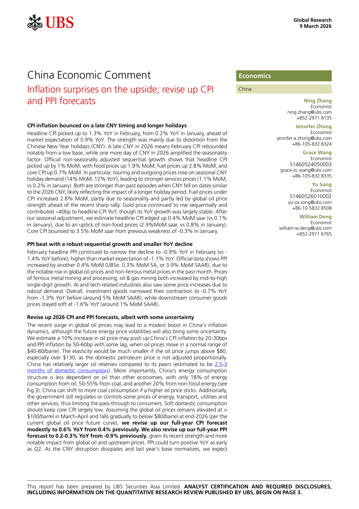
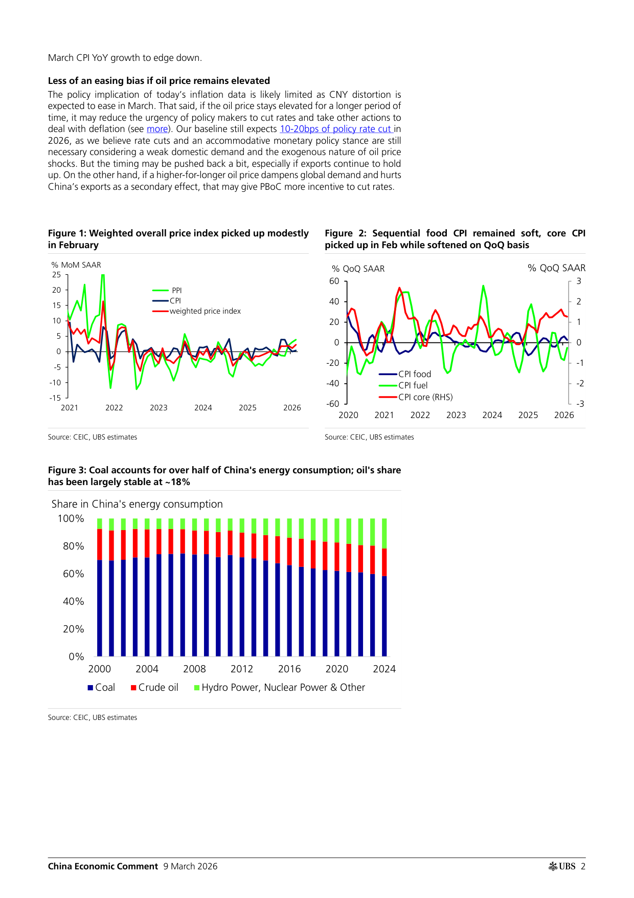
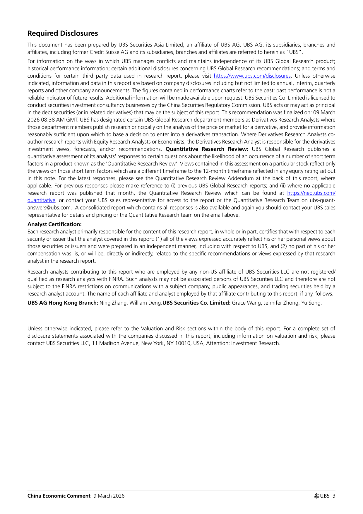
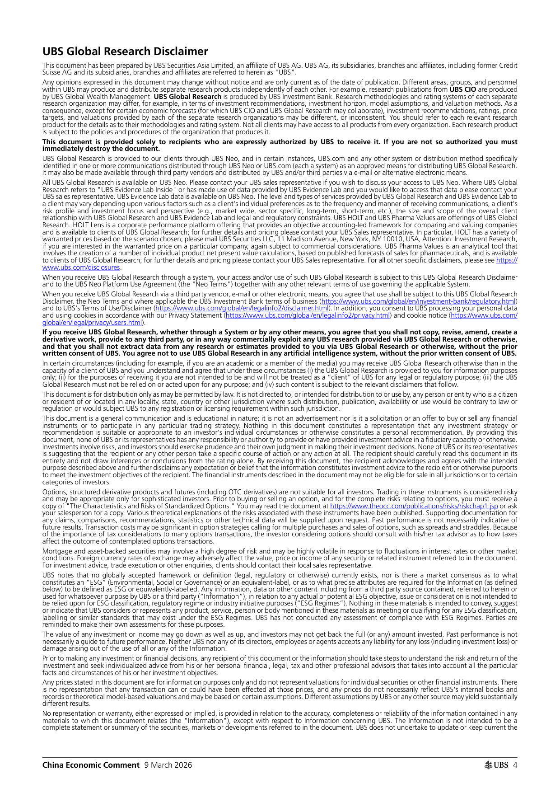
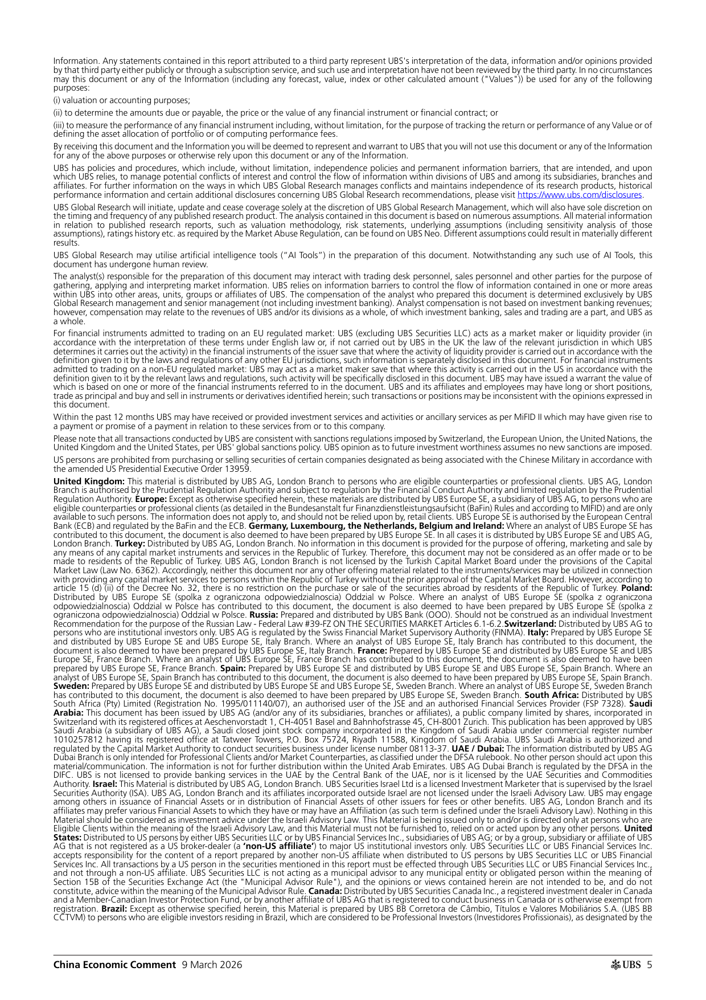
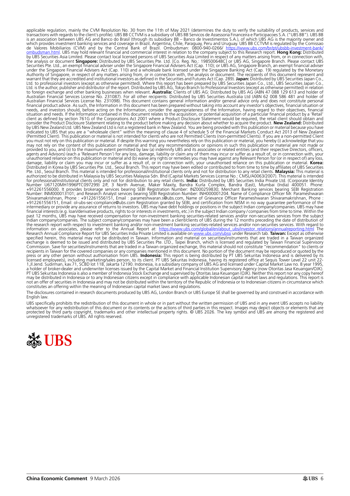

# Inflation surprises on the upside; revise up CPI and PPI forecasts

- 原始文件：`China Economic Comment .pdf`
- 生成时间：`2026-03-18T22:23:45`

## AI 总结

# 核心结论
1. <mark class="rrc-highlight-insight">2026年2月CPI同比、环比均超市场预期</mark>，主要由春节假期错峰、假期时长更长的季节性因素驱动，服务类价格涨幅明显高于往年同期水平。
2. 2026年2月PPI<mark class="rrc-highlight-data">同比</mark>降幅收窄、<mark class="rrc-highlight-data">环比</mark>保持正增长，主要受全球油价、有色金属价格上涨带动，下游消费品价格仍处于疲软状态。
3. <mark class="rrc-highlight-insight">油价上涨对中国通胀的传导效应弱于其他经济体</mark>，主因中国能源结构煤炭占比高、有成品油价格调控机制、石油储备充足，可通过能源替代、价格管制缓解冲击。
4. 瑞银小幅上调2026年全年CPI、PPI预测，<mark class="rrc-highlight-insight">PPI同比最早有望于2026年二季度转正</mark>。
5. 若油价持续高位将小幅降低货币宽松紧迫性，或推迟降息时点；但若油价上涨冲击全球外需拖累中国出口，反而可能强化降息动力，<mark class="rrc-highlight-insight">基准预期仍为2026年降息10-20个基点</mark>。

# 关键数字
6. 2026年2月CPI<mark class="rrc-highlight-data">同比</mark>涨<mark class="rrc-highlight-data">1.3%</mark>（前值<mark class="rrc-highlight-data">0.2%</mark>，市场预期<mark class="rrc-highlight-data">0.9%</mark>），<mark class="rrc-highlight-data">环比</mark>涨<mark class="rrc-highlight-data">1%</mark>；经季调后CPI<mark class="rrc-highlight-data">环比</mark>折年率<mark class="rrc-highlight-data">0.4%</mark>（前值<mark class="rrc-highlight-data">0.1%</mark>），季调后核心CPI<mark class="rrc-highlight-data">环比</mark>折年率<mark class="rrc-highlight-data">3.5%</mark>（前值-<mark class="rrc-highlight-data">0.3%</mark>）。
7. 2月CPI分项：食品<mark class="rrc-highlight-data">环比</mark>涨<mark class="rrc-highlight-data">1.9%</mark>、燃料<mark class="rrc-highlight-data">环比</mark>涨<mark class="rrc-highlight-data">2.8%</mark>、核心CPI<mark class="rrc-highlight-data">环比</mark>涨<mark class="rrc-highlight-data">0.7%</mark>；旅游和外出就餐价格<mark class="rrc-highlight-data">环比</mark>涨<mark class="rrc-highlight-data">14%</mark>、<mark class="rrc-highlight-data">同比</mark>涨<mark class="rrc-highlight-data">12%</mark>，带动服务价格<mark class="rrc-highlight-data">环比</mark>涨<mark class="rrc-highlight-data">1.1%</mark>（前值<mark class="rrc-highlight-data">0.2%</mark>）；金价对CPI<mark class="rrc-highlight-data">同比</mark>贡献约40个基点。
8. 2026年2月PPI<mark class="rrc-highlight-data">同比</mark>降<mark class="rrc-highlight-data">0.9%</mark>（前值降<mark class="rrc-highlight-data">1.4%</mark>，市场预期降<mark class="rrc-highlight-data">1.1%</mark>），<mark class="rrc-highlight-data">环比</mark>涨<mark class="rrc-highlight-data">0.4%</mark>；黑色金属、油气开采加工价格<mark class="rrc-highlight-data">环比</mark>中高个位数上涨。
9. 2月PPI分项：投资品<mark class="rrc-highlight-data">同比</mark>降<mark class="rrc-highlight-data">0.7%</mark>（前值降<mark class="rrc-highlight-data">1.3%</mark>），下游消费品<mark class="rrc-highlight-data">同比</mark>降<mark class="rrc-highlight-data">1.6%</mark>。
10. 40-<mark class="rrc-highlight-data">80美元</mark>/桶区间内油价每涨<mark class="rrc-highlight-data">10%</mark>，将推高中国CPI 20-30个基点、PPI 50-60个基点，油价高于<mark class="rrc-highlight-data">80美元</mark>/桶时传导弹性大幅下降。
11. 中国能源消费结构中煤炭占50-<mark class="rrc-highlight-data">55%</mark>、石油占<mark class="rrc-highlight-data">18%</mark>、非化石能源占<mark class="rrc-highlight-data">20%</mark>，石油储备约相当于2.5-3个月国内消费量；瑞银上调2026年全年CPI预测至<mark class="rrc-highlight-data">0.6%</mark>（前值<mark class="rrc-highlight-data">0.4%</mark>），全年PPI预测上调至<mark class="rrc-highlight-data">同比</mark>增0.2-<mark class="rrc-highlight-data">0.3%</mark>。

## 第 1 页

### 中文

CPI通胀在晚些时候和更长的假期反弹
2月份整体消费物价指数<mark class="rrc-highlight-data">同比</mark>上涨<mark class="rrc-highlight-data">1.3%</mark>，高于1月份的<mark class="rrc-highlight-data">0.2%</mark>
市场预期<mark class="rrc-highlight-data">同比</mark>增长<mark class="rrc-highlight-data">0.9%</mark>。这一优势主要是由于
中国新年假期（CNY）。2026年晚些时候的CNY意味着2月份的CPI反弹
值得注意的是，基数较低，而2026年的一天人民币放大了季节性
因素。官方非季节性调整的连续增长显示，标题CPI
<mark class="rrc-highlight-data">环比</mark>上涨<mark class="rrc-highlight-data">1%</mark>，食品价格<mark class="rrc-highlight-data">环比</mark>上涨<mark class="rrc-highlight-data">1.9%</mark>，燃料价格<mark class="rrc-highlight-data">环比</mark>上涨<mark class="rrc-highlight-data">2.8%</mark>
核心消费物价指数<mark class="rrc-highlight-data">环比</mark>上涨<mark class="rrc-highlight-data">0.7%</mark>。特别是，季节性CNY的旅游和外出价格上涨
假日需求（<mark class="rrc-highlight-data">14%</mark>，<mark class="rrc-highlight-data">同比</mark><mark class="rrc-highlight-data">12%</mark>），导致服务价格上涨（<mark class="rrc-highlight-data">1.1%</mark>，
与1月份的<mark class="rrc-highlight-data">0.2%</mark>相比）。两者都比过去人民币在类似日期下跌的情况要强
至2026年人民币，可能反映了更长假期的影响。燃料价格低于
CPI<mark class="rrc-highlight-data">环比</mark>增长<mark class="rrc-highlight-data">2.8%</mark>，部分原因是季节性，部分原因是全球油价
近期大幅上涨之前的强势。金价继续连续上涨
尽管<mark class="rrc-highlight-data">同比</mark>增长基本稳定，但对整体消费物价指数<mark class="rrc-highlight-data">同比</mark>贡献约40个基点。之后
我们的季节性调整，我们估计标题CPI小幅上涨<mark class="rrc-highlight-data">0.4%</mark>MoM saar（vs <mark class="rrc-highlight-data">0.1%</mark>
1月份），由于非食品价格上涨（1月份为<mark class="rrc-highlight-data">2.9%</mark>，1月份为<mark class="rrc-highlight-data">0.8%</mark>）。
核心消费物价指数从1月份的-<mark class="rrc-highlight-data">0.3%</mark>反弹至<mark class="rrc-highlight-data">3.5%</mark>。

PPI强劲的连续增长和较小的<mark class="rrc-highlight-data">同比</mark>下降
2月份整体生产者价格指数继续收窄跌幅，<mark class="rrc-highlight-data">同比</mark>降至-<mark class="rrc-highlight-data">0.9%</mark>
前<mark class="rrc-highlight-data">同比</mark>增长<mark class="rrc-highlight-data">1.4%</mark>），高于市场预期的<mark class="rrc-highlight-data">同比</mark>增长-<mark class="rrc-highlight-data">1.1%</mark>。官方数据显示生产者价格指数
再增加<mark class="rrc-highlight-data">0.4%</mark>的月收入（UBSe： <mark class="rrc-highlight-data">0.3%</mark>的月收入SA，或<mark class="rrc-highlight-data">3.9%</mark>的月收入SAAR），原因是
过去一个月全球油价和有色金属价格的显著上涨。价格
黑色金属开采和加工、油气开采均增长中高
个位数增长。人工智能和科技相关行业的价格也出现了一些上涨，原因是
需求强劲。总体而言，投资品<mark class="rrc-highlight-data">同比</mark>收缩幅度收窄至-<mark class="rrc-highlight-data">0.7%</mark>
从之前的-<mark class="rrc-highlight-data">1.3%</mark>（月SAAR约<mark class="rrc-highlight-data">5%</mark>），而下游消费品
价格保持疲软，<mark class="rrc-highlight-data">同比</mark>下跌<mark class="rrc-highlight-data">1.6%</mark>（约为<mark class="rrc-highlight-data">1%</mark>的月SAAR）。

上调2026年CPI和PPI预测，尽管存在一些不确定性
最近全球油价的飙升可能会导致中国的通胀略有上升
动态，虽然未来能源价格的波动也会带来一些不确定性。
我们估计油价上涨<mark class="rrc-highlight-data">10%</mark>可能会将中国的CPI通胀推高20-30个基点
和生产者价格指数通胀50-60个基点有一定的滞后，当油价在正常范围内波动时
<mark class="rrc-highlight-data">40美元</mark>-<mark class="rrc-highlight-data">80美元</mark>/桶。如果油价跳升至<mark class="rrc-highlight-data">80美元</mark>以上，弹性会小得多，
尤其是130多美元，因为国内石油价格没有按比例调整。
与其他国家相比，中国的石油储量相对较大（估计为2.5-3
月的国内消耗）。更重要的是，中国的能源消耗
结构比其他经济体更少依赖石油，只有<mark class="rrc-highlight-data">18%</mark>的能源
石油消费，50-<mark class="rrc-highlight-data">55%</mark>来自煤炭，另外<mark class="rrc-highlight-data">20%</mark>来自非化石能源（见
图3）。如果油价持续上涨，中国可以转向更多的煤炭消费。此外，
政府仍然管制或控制一些能源、交通、公用事业和
其他服务，从而限制了对消费者的传递。软国内消费
应该保持核心消费物价指数在很大程度上较低。假设全球油价保持在>
3月至4月为<mark class="rrc-highlight-data">100美元</mark>/桶，2026年底逐渐降至<mark class="rrc-highlight-data">80美元</mark>/桶以下
当前全球油价未来曲线），我们上调了全年CPI预测
从之前的<mark class="rrc-highlight-data">0.4%</mark>小幅上调至<mark class="rrc-highlight-data">0.6%</mark>。我们还上调了全年生产者价格指数
鉴于其近期的强劲势头和更多优势，预计<mark class="rrc-highlight-data">同比</mark>增长0.2-<mark class="rrc-highlight-data">0.3%</mark>
全球石油和上游价格的显著影响。PPI可能最早<mark class="rrc-highlight-data">同比</mark>转正
作为Q2。随着CNY中断的消散和去年的基数正常化，我们预计

本报告由瑞银证券亚洲有限公司编制。分析师认证和要求披露，
包括瑞银出版的定量研究评论的信息，从第3页开始。

### 英文

CPI inflation bounced on a late CNY timing and longer holidays
Headline CPI picked up to 1.3% YoY in February, from 0.2% YoY in January, ahead of
market expectation of 0.9% YoY. The strength was mainly due to  distortion from the
Chinese New Year  holidays (CNY). A late CNY in 2026 means February CPI rebounded
notably from a low base, while one more day of  CNY in 2026 amplified the seasonality
factor. Official non-seasonally adjusted sequential growth shows that headline CPI
picked up by 1% MoM, with food prices up 1.9% MoM, fuel prices up 2.8% MoM, and
core CPI  up  0.7% MoM. In particular, touring and outgoing prices rose on seasonal CNY
holiday demand (14% MoM, 12% YoY), leading to stronger services prices (1.1% MoM,
vs 0.2% in January). Both are stronger than past episodes when CNY fell on dates similar
to the 2026 CNY, likely reflecting the impact of a longer holiday period. Fuel prices under
CPI increased  2.8% MoM, partly due to seasonality and partly led by global oil price
strength ahead of the recent sharp rally. Gold price continued to rise sequentially and
contributed ~40bp to headline CPI YoY, though its YoY growth was largely stable. After
our seasonal adjustment, we estimate  headline CPI edged up  0.4% MoM saar (vs 0.1%
in January), due to an uptick of non-food prices (2.9%MoM saar, vs 0.8% in January).
Core CPI bounced to 3.5% MoM saar from previous weakness of -0.3% in January.

PPI beat with a robust sequential growth and smaller YoY decline
February headline PPI continued to narrow the decline to -0.9% YoY in February (vs -
1.4% YoY before), higher than market expectation of -1.1% YoY. Official data shows PPI
increased by another 0.4% MoM (UBSe: 0.3% MoM SA, or 3.9% MoM SAAR), due to
the notable rise in global oil prices and non-ferrous metal prices in the past month. Prices
of ferrous metal mining and processing, oil & gas mining both increased by mid-to-high
single-digit growth. AI and tech-related industries also saw some price increases due to
robust demand. Overall, investment goods narrowed their contraction to -0.7% YoY
from -1.3% YoY before (around 5% MoM SAAR), while downstream consumer goods
prices stayed soft at -1.6% YoY (around 1% MoM SAAR).

Revise up 2026 CPI and PPI forecasts, albeit with some uncertainty
The recent surge in global oil prices may lead to a modest boost in China’s inflation
dynamics, although the future energy price volatilities will also bring some uncertainty.
We estimate  a 10% increase in oil price may push up China’s CPI inflation by 20-30bps
and PPI inflation by 50-60bp with some lag, when oil prices move in a normal range of
$40-80/barrel. The elasticity would be much smaller if the oil price jumps above $80,
especially over $130, as the domestic petroleum price is not adjusted proportionally.
China has relatively larger oil reserves compared to its peers (estimated to be 2.5-3
months of domestic consumption). More importantly, China’s energy consumption
structure is less dependent on oil than other economies, with only 18% of energy
consumption from oil, 50-55% from coal, and another 20% from non-fossil energy (see
Fig 3). China can shift to more coal consumption if a higher oil price sticks. Additionally,
the government still regulates or controls some prices of energy, transport, utilities and
other services, thus limiting the pass-through to consumers. Soft domestic consumption
should keep core CPI largely low. Assuming the global oil prices remains elevated at >
$100/barrel in March-April and falls gradually to below $80/barrel at end-2026 (per the
current global oil price future curve), we revise up our full-year CPI forecast
modestly to 0.6% YoY from 0.4% previously. We also revise up our full-year PPI
forecast to 0.2-0.3% YoY from -0.9% previously, given its recent strength and more
notable impact from global oil and upstream prices. PPI could turn positive YoY as early
as Q2. As the CNY disruption dissipates and last year’s base normalizes, we expect

This report has been prepared by UBS Securities Asia Limited. ANALYST CERTIFICATION AND REQUIRED DISCLOSURES,
including information on the Quantitative Research Review published by UBS, begin on page 3.

### 原页图表

*第 1 页图表预览*

## 第 2 页

### 中文

<mark class="rrc-highlight-insight">如果油价保持高位，宽松倾向就会减少</mark>
由于人民币扭曲，<mark class="rrc-highlight-insight">今天通胀数据的政策含义可能有限</mark>
预计将在3月份缓解。也就是说，如果油价持续较长时间的上涨
这可能会降低决策者降息和采取其他行动的紧迫性
应对通货紧缩（查看更多）。<mark class="rrc-highlight-insight">我们的基线仍预计政策利率将下调10-20个基点</mark>
2026年，因为我们认为降息和宽松的货币政策立场仍然存在
考虑到国内需求疲软和油价的外生性质，这是必要的
冲击。但时机可能会推迟一点，尤其是如果出口继续保持不变
另一方面，如果油价持续上涨抑制全球需求并造成伤害
作为中国出口的次要影响，这可能会给中国央行更多降息的动力。

### 英文

Less of an easing bias if oil price remains elevated
The policy implication of today’s inflation data is likely limited as CNY distortion is
expected to ease in March. That said, if the oil price stays elevated for a longer period of
time, it may reduce the urgency of policy makers to cut rates and take other actions to
deal with deflation (see more). Our baseline still expects 10-20bps of policy rate cut in
2026, as we believe rate cuts and an accommodative monetary policy stance are still
necessary considering a weak domestic demand and the exogenous nature of oil price
shocks. But the timing may be pushed back a bit, especially if exports continue to hold
up. On the other hand, if a higher-for-longer oil price dampens global demand and hurts
China’s exports as a secondary effect, that may give PBoC more incentive to cut rates.

### 原页图表

*第 2 页图表预览*

## 第 3 页

### 中文

所需披露

本文件由瑞银集团的关联公司瑞银证券亚洲有限公司编写。瑞银集团、其子公司、分支机构和
关联公司，包括前瑞士信贷股份有限公司及其子公司、分支机构和关联公司，在此称为“瑞银”。

有关瑞银管理冲突和保持其瑞银全球研究产品独立性的方式的信息；
历史业绩信息；关于瑞银全球研究建议的某些额外披露；以及条款和
研究报告中使用的某些第三方数据的条件，请访问https://www.ubs.com/disclosures。除非另有说明
指出，本报告中的信息和数据基于公司披露，包括但不限于年度、中期、季度
报告和其他公司公告。业绩图表中包含的数字是指过去；过去的业绩不是
未来业绩的可靠指标。更多信息将根据要求提供。瑞银证券有限公司被授权
由中国证监会进行证券投资顾问业务。瑞银担任或可能担任委托人
可能是本报告主题的债务证券（或相关衍生工具）。这项建议于3月9日定稿
格林威治时间2026 08:38。瑞银已指定瑞银全球研究部门的某些成员为衍生品研究分析师
这些部门成员主要发表关于衍生品价格或市场分析的研究，并提供信息
合理地足以作为决定进行衍生品交易的基础。衍生品研究分析师共同——
作者与股票研究分析师或经济学家的研究报告，衍生品研究分析师负责衍生品
投资观点、预测和/或建议。定量研究评论：瑞银全球研究发布了一份
定量评估其分析师对一些短期事件发生可能性的某些问题的回答
称为“定量研究评论”的产品中的因素。本评估中包含的对特定库存的观点仅反映
对任何股票评级中反映的与12个月时间框架不同的短期因素的看法
在本说明中。有关最新回复，请参阅本报告后面的定量研究审查附录，其中
适用。对于以前的回复，请参考（i）以前的瑞银全球研究报告；（ii）如果不适用
当月发表了研究报告，《定量研究评论》，可在https://neo.ubs.com/
定量，或联系您的瑞银销售代表以获取报告或瑞银定量研究团队-
answers@ubs.com。您还可以获得包含所有回复的综合报告，您应该再次联系您的瑞银销售人员
详细信息和定价代表或上面电子邮件中的定量研究团队。

分析师认证：
对本研究报告的全部或部分内容负有主要责任的每一位研究分析师都证明
分析师在本报告中涵盖的证券或发行人：（1）所表达的所有观点准确反映了他或她对以下方面的个人观点
这些证券或发行人以独立的方式准备，包括与瑞银有关，以及（2）他或她的任何部分
薪酬过去、现在或将来与该研究表达的具体建议或观点直接或间接相关
研究报告中的分析师。

受雇于瑞银证券有限责任公司任何非美国关联公司的研究分析师未注册/
金融监管局合格的研究分析师。此类分析师可能不是瑞银证券有限责任公司的关联人员，因此不是
受FINRA对与标的公司通信、公开露面和交易证券的限制
研究分析师账户。为本报告做出贡献的每个关联公司和该关联公司雇用的分析师的名称（如果有）如下。

瑞银集团香港分行：张宁、威廉Deng.UBS证券有限公司：王慧、钟玉玲、宋宇。

除非另有说明，请参阅本报告正文中的估值和风险部分。有关完整的
与本报告中讨论的公司相关的披露声明，包括估值和风险信息，请
联系瑞银证券有限责任公司，纽约麦迪逊大道11号，纽约州10010，美国，注意：投资研究。

中国经济评论2026年3月9日
ab 3

### 英文

Required Disclosures

This document has been prepared by UBS Securities Asia Limited, an affiliate of UBS AG. UBS AG, its subsidiaries, branches and
affiliates, including former Credit Suisse AG and its subsidiaries, branches and affiliates are referred to herein as "UBS".

For information on the ways in which UBS manages conflicts and maintains independence of its UBS Global Research product;
historical performance information; certain additional disclosures concerning UBS Global Research recommendations; and terms and
conditions for certain third party data used in research report, please visit https://www.ubs.com/disclosures. Unless otherwise
indicated, information and data in this report are based on company disclosures including but not limited to annual, interim, quarterly
reports and other company announcements. The figures contained in performance charts refer to the past; past performance is not a
reliable indicator of future results. Additional information will be made available upon request. UBS Securities Co. Limited is licensed to
conduct securities investment consultancy businesses by the China Securities Regulatory Commission. UBS acts or may act as principal
in the debt securities (or in related derivatives) that may be the subject of this report. This recommendation was finalized on: 09 March
2026 08:38 AM GMT. UBS has designated certain UBS Global Research department members as Derivatives Research Analysts where
those department members publish research principally on the analysis of the price or market for a derivative, and provide information
reasonably sufficient upon which to base a decision to enter into a derivatives transaction. Where Derivatives Research Analysts co-
author research reports with Equity Research Analysts or Economists, the Derivatives Research Analyst is responsible for the derivatives
investment views, forecasts, and/or recommendations. Quantitative Research Review: UBS Global Research publishes a
quantitative assessment of its analysts' responses to certain questions about the likelihood of an occurrence of a number of short term
factors in a product known as the 'Quantitative Research Review'. Views contained in this assessment on a particular stock reflect only
the views on those short term factors which are a different timeframe to the 12-month timeframe reflected in any equity rating set out
in this note. For the latest responses, please see the Quantitative Research Review Addendum at the back of this report, where
applicable. For previous responses please make reference to (i) previous UBS Global Research reports; and (ii) where no applicable
research report was published that month, the Quantitative Research Review which can be found at https://neo.ubs.com/
quantitative, or contact your UBS sales representative for access to the report or the Quantitative Research Team on ubs-quant-
answers@ubs.com.  A consolidated report which contains all responses is also available and again you should contact your UBS sales
representative for details and pricing or the Quantitative Research team on the email above.

Analyst Certification:
Each research analyst primarily responsible for the content of this research report, in whole or in part, certifies that with respect to each
security or issuer that the analyst covered in this report: (1) all of the views expressed accurately reflect his or her personal views about
those securities or issuers and were prepared in an independent manner, including with respect to UBS, and (2) no part of his or her
compensation was, is, or will be, directly or indirectly, related to the specific recommendations or views expressed by that research
analyst in the research report.

Research analysts contributing to this report who are employed by any non-US affiliate of UBS Securities LLC are not registered/
qualified as research analysts with FINRA. Such analysts may not be associated persons of UBS Securities LLC and therefore are not
subject to the FINRA restrictions on communications with a subject company, public appearances, and trading securities held by a
research analyst account. The name of each affiliate and analyst employed by that affiliate contributing to this report, if any, follows.

UBS AG Hong Kong Branch: Ning Zhang, William Deng.UBS Securities Co. Limited: Grace Wang, Jennifer Zhong, Yu Song.

Unless otherwise indicated, please refer to the Valuation and Risk sections within the body of this report. For a complete set of
disclosure statements associated with the companies discussed in this report, including information on valuation and risk, please
contact UBS Securities LLC, 11 Madison Avenue, New York, NY 10010, USA, Attention: Investment Research.

China Economic Comment 9 March 2026
ab 3

### 原页图表

*第 3 页图表预览*

## 第 4 页

### 中文

瑞银全球研究免责声明

本文件由瑞银集团的关联公司瑞银证券亚洲有限公司编制。瑞银集团、其子公司、分支机构和关联公司，包括前信贷
瑞士股份有限公司及其子公司、分支机构和关联公司在此被称为“瑞银”。
本文档中表达的任何意见可能会更改，恕不另行通知，并且仅在发布之日是最新的。不同的领域、群体和人员
在瑞银内部，可以独立制作和分发单独的研究产品。例如，瑞银首席信息官的研究出版物
瑞银全球财富管理。瑞银全球研究由瑞银投资银行制作。每个单独的研究方法和评级系统
例如，研究机构可能在投资建议、投资范围、模型假设和估值方法方面有所不同。作为一个
后果，除了某些经济预测（瑞银首席信息官和瑞银全球研究可能合作）、投资建议、评级、价格
每个独立研究机构提供的目标和估值可能不同或不一致。你应该参考每个相关的研究
产品以获取有关其方法和评级系统的详细信息。并非所有客户都可以访问每个组织的所有产品。每个研究产品
受制于生产它的组织的政策和程序。
本文件仅提供给瑞银明确授权接收的收件人。如果您没有获得授权，您必须
立即销毁文件。
瑞银全球研究通过瑞银Neo提供给我们的客户，在某些情况下，UBS.com和任何其他系统或分销方法
在通过UBS Neo或UBS.com（每个系统）分发的一个或多个通信中标识为用于UBS全球研究的批准分发装置。
它也可能通过第三方供应商提供，并由瑞银和/或第三方通过电子邮件或其他电子方式分发。
所有UBS Global Research均可在UBS Neo上获得。如果您希望讨论您对UBS Neo的访问，请联系您的UBS销售代表。瑞银全球在哪里
研究参考“瑞银证据实验室内部”或已使用瑞银证据实验室提供的数据，您想访问该数据，请联系您的
瑞银销售代表。瑞银证据实验室的数据可在瑞银尼奥获得。瑞银全球研究和瑞银证据实验室提供的服务水平和类型
客户可能因各种因素而异，例如客户对接收通信的频率和方式的个人偏好、客户的
风险概况和投资重点和视角（例如，市场范围、特定行业、长期、短期等），整体客户的规模和范围
与瑞银全球研究和瑞银证据实验室的关系以及法律和监管限制。瑞银HOLT和瑞银制药价值是瑞银全球的产品
研究。HOLT Lens是一个企业绩效平台产品，为比较和评估公司提供了一个客观的会计主导框架
并可供瑞银全球研究的客户使用；有关详细信息和定价，请联系您的瑞银销售代表。特别是，HOLT有各种
保证价格基于所选方案；请邮寄瑞银证券有限责任公司，11 Madison Avenue，New York，NY 10010，USA，注意：Investment Research，
如果您对特定公司的保证价格感兴趣，同样要考虑到商业因素。瑞银制药价值是一种分析工具
涉及根据已发布的药品销售预测创建一些单独的产品净现值计算，并且可用
致瑞银全球研究的客户；有关详细信息和定价，请联系您的瑞银销售代表。有关所有其他特定免责声明，请参阅https：//
www.ubs.com/disclosures。
当您通过系统接收UBS Global Research时，您对该UBS Global Research的访问和/或使用受本UBS Global Research免责声明的约束
以及瑞银Neo平台使用协议（“Neo条款”）以及管理适用系统的任何其他相关使用条款。
当您通过第三方供应商、电子邮件或其他电子方式收到UBS Global Research时，您同意使用受本UBS Global Research的约束
免责声明、Neo条款以及适用的瑞银投资银行业务条款（https://www.ubs.com/global/en/investment-bank/regulatory.html）
以及瑞银的用户使用条款/免责声明（https://www.ubs.com/global/en/legalinfo2/disclaimer.html）。此外，您同意瑞银处理您的个人数据
并根据我们的隐私声明（https://www.ubs.com/global/en/legalinfo2/privacy.html）和cookie声明（https://www.ubs.com/
global/en/法律/隐私/用户. html）。
如果您通过系统或任何其他方式获得瑞银全球研究，您同意您不得复制、修改、修改、创建
衍生作品，提供给任何第三方，或以任何方式商业利用通过瑞银全球研究或其他方式提供的任何瑞银研究，
您不得从通过UBS Global Research或其他方式提供给您的任何研究或估计中提取数据，除非事先
瑞银的书面同意。您同意在未经瑞银事先书面同意的情况下，不在任何人工智能系统中使用UBS Global Research。
在某些情况下（包括例如，如果您是学者或媒体成员），您可能会在
瑞银客户的身份，您理解并同意在这些情况下（i）瑞银全球研究提供给您以供参考
仅限；（ii）出于任何法律或监管目的，您无意也不会被视为瑞银的“客户”；（iii）瑞银
Global Research不得以任何目的为依据或采取行动；（iv）此类内容受以下相关免责声明的约束。
本文件仅在法律允许的情况下分发。它不针对或打算分发给任何公民或实体或由其使用
或居住或位于任何地方、州、国家或其他司法管辖区，此类分发、出版、可用性或使用将违反法律或
监管或将使瑞银在此类司法管辖区内遵守任何注册或许可要求。
本文件是一般通信，具有教育性质；它不是广告，也不是买卖任何金融产品的招揽或要约
工具或参与任何特定的交易策略。本文件中的任何内容均不构成任何投资策略或
推荐适合或适合投资者的个人情况，或以其他方式构成个人推荐。通过提供这个
文件，瑞银或其代表没有任何责任或权力以信托身份或其他身份提供或已经提供投资建议。
<mark class="rrc-highlight-insight">投资涉及风险，投资者在作出投资决定时应审慎行事</mark>，并作出自己的判断。瑞银或其代表
建议收件人或任何其他人采取特定的行动方案或任何行动。收件人应仔细阅读其
完整，而不是仅从评级中得出推论或结论。通过收到本文件，收件人承认并同意预期的
上述目的，并进一步否认任何期望或相信该信息构成对接收者的投资建议或以其他方式声称
满足接受者的投资目标。文件中描述的金融工具可能不符合在所有司法管辖区或某些司法管辖区销售的条件
投资者类别。
期权、结构性衍生产品和期货（包括场外衍生产品）并不适合所有投资者。这些工具的交易被认为是有风险的
可能只适合老练的投资者。在买卖期权之前，对于与期权相关的全部风险，您必须收到
“标准化期权的特征和风险”副本您可以在https://www.theocc.com/publications/risks/riskchap1.jsp阅读该文件或询问
向您的销售人员索取一份副本。与这些工具相关的风险的各种理论解释已经发表。支持留档
任何索赔、比较、建议、统计数据或其他技术数据将根据要求提供。过去的表现不一定表明
未来的结果。交易成本在要求多次购买和出售期权的期权策略中可能很重要，例如点差和跨座。因为
税务考虑对许多期权交易的重要性，考虑期权的投资者应与他/她的税务顾问协商如何征税
影响预期期权交易的结果。
抵押贷款和资产支持证券可能涉及高度风险，并且可能因利率或其他市场的波动而高度波动
条件。外币汇率可能会对文件中提及的任何证券或相关工具的价值、价格或收入产生不利影响。
如需投资建议、交易执行或其他查询，客户应联系当地销售代表。
瑞银指出，目前不存在全球公认的框架或定义（法律、监管或其他），也没有市场共识
构成“ESG”（环境、社会或治理）或等效标签，或信息需要哪些精确属性（如定义
以下）被定义为ESG或equivalently-labelled。包含、提及或
瑞银或第三方用于任何目的（“信息”），与任何实际或潜在的ESG目标、问题或考虑有关，并非旨在
被用于ESG分类、监管制度或行业倡议目的（“ESG制度”）。这些材料中的任何内容都无意传达、暗示
或表明瑞银认为或代表这些材料中提到的任何产品、服务、个人或机构符合或符合任何ESG分类，
ESG制度下可能存在的标签或类似标准。瑞银没有对ESG制度的合规性进行任何评估。各方是
提醒他们为此目的进行自己的评估。
<mark class="rrc-highlight-insight">任何投资或收入的价值可能下降也可能上升</mark>，投资者可能无法收回全部（或任何）投资金额。过去的表现不是
必然是未来表现的指南。瑞银及其任何董事、员工或代理人均不对任何损失（包括投资损失）或
因使用所有或任何信息而造成的损害。
在做出任何投资或财务决定之前，本文件或信息的任何接收者都应采取措施了解风险和回报
投资并从他或她的个人财务、法律、税务和其他专业顾问那里寻求个性化的建议，这些顾问考虑到所有特定的
其投资目标的事实和情况。
本文件中所述的任何价格仅供参考，并不代表个别证券或其他金融工具的估值。那里
不代表任何交易可以或可能以这些价格进行，任何价格不一定反映瑞银的内部账簿和
记录或基于理论模型的估值，并可能基于某些假设。瑞银或任何其他来源的不同假设可能会产生重大收益
不同的结果。
本公司并无明示或隐含地就任何文件所载资料的准确性、完整性或可靠性作出任何陈述或保证
本文件所涉及的材料（“信息”），但有关瑞银的信息除外。该信息无意成为
文件中提及的证券、市场或发展的完整声明或摘要。瑞银不承诺更新或保持最新

中国经济评论2026年3月9日
ab 4

### 英文

UBS Global Research Disclaimer

This document has been prepared by UBS Securities Asia Limited, an affiliate of UBS AG. UBS AG, its subsidiaries, branches and affiliates, including former Credit
Suisse AG and its subsidiaries, branches and affiliates are referred to herein as "UBS".
Any opinions expressed in this document may change without notice and are only current as of the date of publication. Different areas, groups, and personnel
within UBS may produce and distribute separate research products independently of each other. For example, research publications from UBS CIO are produced
by UBS Global Wealth Management. UBS Global Research is produced by UBS Investment Bank. Research methodologies and rating systems of each separate
research organization may differ, for example, in terms of investment recommendations, investment horizon, model assumptions, and valuation methods. As a
consequence, except for certain economic forecasts (for which UBS CIO and UBS Global Research may collaborate), investment recommendations, ratings, price
targets, and valuations provided by each of the separate research organizations may be different, or inconsistent. You should refer to each relevant research
product for the details as to their methodologies and rating system. Not all clients may have access to all products from every organization. Each research product
is subject to the policies and procedures of the organization that produces it.
This document is provided solely to recipients who are expressly authorized by UBS to receive it. If you are not so authorized you must
immediately destroy the document.
UBS Global Research is provided to our clients through UBS Neo, and in certain instances, UBS.com and any other system or distribution method specifically
identified in one or more communications distributed through UBS Neo or UBS.com (each a system) as an approved means for distributing UBS Global Research.
It may also be made available through third party vendors and distributed by UBS and/or third parties via e-mail or alternative electronic means.
All UBS Global Research is available on UBS Neo. Please contact your UBS sales representative if you wish to discuss your access to UBS Neo. Where UBS Global
Research refers to "UBS Evidence Lab Inside" or has made use of data provided by UBS Evidence Lab and you would like to access that data please contact your
UBS sales representative. UBS Evidence Lab data is available on UBS Neo. The level and types of services provided by UBS Global Research and UBS Evidence Lab to
a client may vary depending upon various factors such as a client's individual preferences as to the frequency and manner of receiving communications, a client's
risk profile and investment focus and perspective (e.g., market wide, sector specific, long-term, short-term, etc.), the size and scope of the overall client
relationship with UBS Global Research and UBS Evidence Lab and legal and regulatory constraints. UBS HOLT and UBS Pharma Values are offerings of UBS Global
Research. HOLT Lens is a corporate performance platform offering that provides an objective accounting-led framework for comparing and valuing companies
and is available to clients of UBS Global Research; for further details and pricing please contact your UBS Sales representative. In particular, HOLT has a variety of
warranted prices based on the scenario chosen; please mail UBS Securities LLC, 11 Madison Avenue, New York, NY 10010, USA, Attention: Investment Research,
if you are interested in the warranted price on a particular company, again subject to commercial considerations. UBS Pharma Values is an analytical tool that
involves the creation of a number of individual product net present value calculations, based on published forecasts of sales for pharmaceuticals, and is available
to clients of UBS Global Research; for further details and pricing please contact your UBS Sales representative. For all other specific disclaimers, please see https://
www.ubs.com/disclosures.
When you receive UBS Global Research through a system, your access and/or use of such UBS Global Research is subject to this UBS Global Research Disclaimer
and to the UBS Neo Platform Use Agreement (the "Neo Terms") together with any other relevant terms of use governing the applicable System.
When you receive UBS Global Research via a third party vendor, e-mail or other electronic means, you agree that use shall be subject to this UBS Global Research
Disclaimer, the Neo Terms and where applicable the UBS Investment Bank terms of business (https://www.ubs.com/global/en/investment-bank/regulatory.html)
and to UBS's Terms of Use/Disclaimer (https://www.ubs.com/global/en/legalinfo2/disclaimer.html). In addition, you consent to UBS processing your personal data
and using cookies in accordance with our Privacy Statement (https://www.ubs.com/global/en/legalinfo2/privacy.html) and cookie notice (https://www.ubs.com/
global/en/legal/privacy/users.html).
If you receive UBS Global Research, whether through a System or by any other means, you agree that you shall not copy, revise, amend, create a
derivative work, provide to any third party, or in any way commercially exploit any UBS research provided via UBS Global Research or otherwise,
and that you shall not extract data from any research or estimates provided to you via UBS Global Research or otherwise, without the prior
written consent of UBS. You agree not to use UBS Global Research in any artificial intelligence system, without the prior written consent of UBS.
In certain circumstances (including for example, if you are an academic or a member of the media) you may receive UBS Global Research otherwise than in the
capacity of a client of UBS and you understand and agree that under these circumstances (i) the UBS Global Research is provided to you for information purposes
only; (ii) for the purposes of receiving it you are not intended to be and will not be treated as a “client” of UBS for any legal or regulatory purpose; (iii) the UBS
Global Research must not be relied on or acted upon for any purpose; and (iv) such content is subject to the relevant disclaimers that follow.
This document is for distribution only as may be permitted by law. It is not directed to, or intended for distribution to or use by, any person or entity who is a citizen
or resident of or located in any locality, state, country or other jurisdiction where such distribution, publication, availability or use would be contrary to law or
regulation or would subject UBS to any registration or licensing requirement within such jurisdiction.
This document is a general communication and is educational in nature; it is not an advertisement nor is it a solicitation or an offer to buy or sell any financial
instruments or to participate in any particular trading strategy. Nothing in this document constitutes a representation that any investment strategy or
recommendation is suitable or appropriate to an investor’s individual circumstances or otherwise constitutes a personal recommendation. By providing this
document, none of UBS or its representatives has any responsibility or authority to provide or have provided investment advice in a fiduciary capacity or otherwise.
Investments involve risks, and investors should exercise prudence and their own judgment in making their investment decisions. None of UBS or its representatives
is suggesting that the recipient or any other person take a specific course of action or any action at all. The recipient should carefully read this document in its
entirety and not draw inferences or conclusions from the rating alone. By receiving this document, the recipient acknowledges and agrees with the intended
purpose described above and further disclaims any expectation or belief that the information constitutes investment advice to the recipient or otherwise purports
to meet the investment objectives of the recipient. The financial instruments described in the document may not be eligible for sale in all jurisdictions or to certain
categories of investors.
Options, structured derivative products and futures (including OTC derivatives) are not suitable for all investors. Trading in these instruments is considered risky
and may be appropriate only for sophisticated investors. Prior to buying or selling an option, and for the complete risks relating to options, you must receive a
copy of "The Characteristics and Risks of Standardized Options." You may read the document at https://www.theocc.com/publications/risks/riskchap1.jsp or ask
your salesperson for a copy. Various theoretical explanations of the risks associated with these instruments have been published. Supporting documentation for
any claims, comparisons, recommendations, statistics or other technical data will be supplied upon request. Past performance is not necessarily indicative of
future results. Transaction costs may be significant in option strategies calling for multiple purchases and sales of options, such as spreads and straddles. Because
of the importance of tax considerations to many options transactions, the investor considering options should consult with his/her tax advisor as to how taxes
affect the outcome of contemplated options transactions.
Mortgage and asset-backed securities may involve a high degree of risk and may be highly volatile in response to fluctuations in interest rates or other market
conditions. Foreign currency rates of exchange may adversely affect the value, price or income of any security or related instrument referred to in the document.
For investment advice, trade execution or other enquiries, clients should contact their local sales representative.
UBS notes that no globally accepted framework or definition (legal, regulatory or otherwise) currently exists, nor is there a market consensus as to what
constitutes an “ESG” (Environmental, Social or Governance) or an equivalent-label, or as to what precise attributes are required for the Information (as defined
below) to be defined as ESG or equivalently-labelled. Any information, data or other content including from a third party source contained, referred to herein or
used for whatsoever purpose by UBS or a third party (“Information”), in relation to any actual or potential ESG objective, issue or consideration is not intended to
be relied upon for ESG classification, regulatory regime or industry initiative purposes (“ESG Regimes”). Nothing in these materials is intended to convey, suggest
or indicate that UBS considers or represents any product, service, person or body mentioned in these materials as meeting or qualifying for any ESG classification,
labelling or similar standards that may exist under the ESG Regimes. UBS has not conducted any assessment of compliance with ESG Regimes. Parties are
reminded to make their own assessments for these purposes.
The value of any investment or income may go down as well as up, and investors may not get back the full (or any) amount invested. Past performance is not
necessarily a guide to future performance. Neither UBS nor any of its directors, employees or agents accepts any liability for any loss (including investment loss) or
damage arising out of the use of all or any of the Information.
Prior to making any investment or financial decisions, any recipient of this document or the information should take steps to understand the risk and return of the
investment and seek individualized advice from his or her personal financial, legal, tax and other professional advisors that takes into account all the particular
facts and circumstances of his or her investment objectives.
Any prices stated in this document are for information purposes only and do not represent valuations for individual securities or other financial instruments. There
is no representation that any transaction can or could have been effected at those prices, and any prices do not necessarily reflect UBS's internal books and
records or theoretical model-based valuations and may be based on certain assumptions. Different assumptions by UBS or any other source may yield substantially
different results.
No representation or warranty, either expressed or implied, is provided in relation to the accuracy, completeness or reliability of the information contained in any
materials to which this document relates (the "Information"), except with respect to Information concerning UBS. The Information is not intended to be a
complete statement or summary of the securities, markets or developments referred to in the document. UBS does not undertake to update or keep current the

China Economic Comment 9 March 2026
ab 4

### 原页图表

*第 4 页图表预览*

## 第 5 页

### 中文

信息。本报告中包含的归因于第三方的任何陈述均代表瑞银对所提供的数据、信息和/或意见的解释
该第三方公开或通过订阅服务，并且此类使用和解释未经第三方审查。在任何情况下
本文件或任何信息（包括任何预测、价值、指数或其他计算金额（“值”））可用于以下任何一项
用途：
（i）估值或会计目的；
（ii）确定任何金融工具或金融合同的到期或应付金额、价格或价值；要么
（iii）衡量任何金融工具的表现，包括但不限于为跟踪任何价值或
定义投资组合或计算绩效费用的资产配置。
收到本文件和信息后，您将被视为向瑞银声明并保证您不会使用本文件或任何信息
出于上述任何目的或以其他方式依赖本文档或任何信息。
瑞银有政策和程序，其中包括但不限于独立政策和永久信息壁垒
瑞银依靠它来管理潜在的利益冲突和控制瑞银各部门及其子公司、分支机构和
附属机构。有关瑞银全球研究管理冲突和保持其研究产品独立性的方式的更多信息，历史
有关瑞银全球研究建议的绩效信息和某些额外披露，请访问https://www.ubs.com/disclosures。
瑞银全球研究将完全由瑞银全球研究管理部门自行决定发起、更新和终止保险，瑞银全球研究管理部门也将自行决定
任何已发表研究产品的时间和频率。本文档中包含的分析基于许多假设。所有重要信息
关于已发表的研究报告，如估值方法论、风险陈述、基本假设（包括对这些假设的敏感性分析
假设）、评级历史等。根据市场滥用条例的要求，可以在瑞银尼奥上找到。不同的假设可能会导致实质性的不同
结果。
<mark class="rrc-highlight-insight">瑞银全球研究可能会在准备本文档时使用人工智能工具</mark>（“人工智能工具”）。尽管使用了人工智能工具，但这
文件经过人工审查。
负责编制本文件的分析师可能会与交易台人员、销售人员和其他各方进行互动，以便
收集、应用和解释市场信息瑞银依靠信息壁垒控制包含在一个或多个领域的信息流
在瑞银内部进入瑞银的其他领域、单位、集团或关联公司。准备本文件的分析师的薪酬完全由瑞银决定
全球研究管理层和高级管理层（不包括投资银行）。<mark class="rrc-highlight-insight">分析师薪酬不基于投资银行收入</mark>；
然而，薪酬可能与瑞银和/或其整个部门的收入有关，投资银行、销售和交易是其中的一部分，瑞银作为
一个整体。
对于获准在欧盟监管市场交易的金融工具：瑞银（不包括瑞银证券有限责任公司）充当做市商或流动性提供者（在
根据英国法律对这些条款的解释，或者，如果瑞银不在英国执行，则根据瑞银所在司法管辖区的法律
确定它在发行人的金融工具中开展活动），但流动性提供者的活动是根据
任何其他欧盟司法管辖区的法律法规给予它的定义，此类信息在本文件中单独披露。对于金融工具
允许在非欧盟监管的市场进行交易：瑞银可以作为做市商，除非该活动是根据
相关法律法规赋予其定义，此类活动将在本文件中具体披露。瑞银可能已发行价值为
基于文件中提到的一种或多种金融工具。瑞银及其关联公司和员工可能有多头或空头头寸，
作为委托人进行交易并买卖此处确定的工具或衍生品；此类交易或头寸可能与中表达的意见不一致
这份文件。
在过去12个月内，瑞银可能根据MiFID II接受或提供了投资服务和活动或辅助服务，这可能导致
由本公司或向本公司支付或承诺支付与这些服务有关的款项。
请注意，瑞银进行的所有交易均符合瑞士、欧盟、联合国、
英国和美国，根据瑞银的全球制裁政策。<mark class="rrc-highlight-insight">瑞银对未来投资价值的看法假设没有实施新的制裁</mark>。
美国人被禁止购买或出售被指定为与中国军方有关联的某些公司的证券
经修订的第13959号美国总统行政命令。
英国：本材料由UBS AG伦敦分公司分发给符合条件的交易对手或专业客户。UBS AG，伦敦
分行获保诚监管局授权，并受金融行为监管局监管及保诚有限监管
欧洲监管局：除此处另有规定外，这些材料由UBS AG的子公司UBS Europe SE分发给以下人员
符合条件的交易对手或专业客户（详见德国联邦毛皮Finanzdienstleistungsaufsicht规则和MIFID）
提供给这些人。<mark class="rrc-highlight-insight">这些信息不适用于零售客户，也不应被零售客户依赖</mark>。瑞银欧洲证券交易所获得欧洲中央银行的授权
银行（欧洲央行），由德国联邦金融监管局和欧洲央行监管。德国、卢森堡、荷兰、比利时和爱尔兰：瑞银欧洲证券交易所的一名分析师
为本文件做出贡献，该文件也被视为由瑞银欧洲证券交易所编写。在所有情况下，它都由瑞银欧洲证券交易所和瑞银股份有限公司分发，
伦敦分行。土耳其：由UBS AG伦敦分行发行。本文档中的任何信息均不用于以下人员的提供、营销和销售目的
土耳其共和国任何资本市场工具和服务的任何方式。因此，本文件不得被视为已提出或将被视为要约
针对土耳其共和国居民。UBS AG伦敦分行未获得土耳其资本市场委员会根据资本规定颁发的许可
市场法（第6362号法律）。因此，本文件或与工具/服务相关的任何其他发行材料均不得用于
未经资本市场委员会事先批准，向土耳其共和国境内的人提供任何资本市场服务。然而，根据
第32号法令第15（d）（ii）条对土耳其共和国居民在国外购买或出售证券没有任何限制。波兰：
由瑞银欧洲证券交易所发行（spolka z ogranic😍odPowiedzialnoscia）Oddzial w Polsce。瑞银欧洲证券交易所（spolka z ogranic😍）的分析师
odPowiedzialnoscia）Oddzial w Polsce为本文件做出了贡献，该文件也被视为由UBS Europe SE（spolka z
俄罗斯：由瑞银银行（OOO）编写和分发。不应被解释为个人投资
关于俄罗斯法律的建议-关于证券市场的第39-FZ号联邦法条款6.1-6.2.瑞士：由UBS AG分发给
仅限机构投资者。瑞银集团受瑞士金融市场监管局（FINMA）监管。意大利：瑞银欧洲证券交易所编制
并由瑞银欧洲证券交易所和瑞银欧洲证券交易所意大利分行发行。如果瑞银欧洲证券交易所意大利分行的分析师为本文件做出了贡献，则
文件也被视为由UBS Europe SE意大利分公司准备。法国：由UBS Europe SE编写并由UBS Europe SE和UBS分发
欧洲证券交易所法国分行。如果瑞银欧洲证券交易所法国分行的分析师为本文件做出了贡献，则该文件也被视为
由瑞银欧洲证券交易所法国分行编制。西班牙：由瑞银欧洲证券交易所编制，由瑞银欧洲证券交易所和瑞银欧洲证券交易所西班牙分行分发。其中
瑞银欧洲证券交易所西班牙分公司分析师为本文件做出了贡献，该文件也被视为由瑞银欧洲证券交易所西班牙分公司准备。
瑞典：由瑞银欧洲证券交易所编制，由瑞银欧洲证券交易所和瑞银欧洲证券交易所瑞典分行发行。瑞银欧洲证券交易所瑞典分行的分析师
已为本文件做出贡献，该文件也被视为由UBS Europe SE瑞典分公司编写。南非：由瑞银发行
南非（Pty）有限公司（注册号1995/011140/07），JSE的授权用户和授权金融服务提供商（FSP 7328）。沙特
阿拉伯：本文件由UBS AG（和/或其任何子公司、分支机构或关联公司）发布，该公司是一家股份有限公司，成立于
瑞士，注册办事处位于巴塞尔埃申沃尔施塔特1号CH-4051和苏黎世巴赫霍夫街45号CH-8001。本出版物已获得瑞银集团的批准
沙特阿拉伯（瑞银集团的子公司），一家在沙特阿拉伯王国注册的沙特封闭股份有限公司，商业注册号为
1010257812，注册办事处位于沙特阿拉伯王国利雅得11588号邮政信箱75724号塔特维尔塔。瑞银沙特阿拉伯被授权和
受资本市场管理局监管，以许可证号08113-37开展证券业务。阿联酋/迪拜：瑞银集团发布的信息
迪拜分行仅适用于DFSA规则手册中分类的专业客户和/或市场对手方。任何其他人都不应对此采取行动
材料/通信。该信息不得在阿拉伯联合酋长国内进一步分发。瑞银集团迪拜分行受DFSA监管
DIFC。UBS没有获得阿联酋中央银行在阿联酋提供银行服务的许可，也没有获得阿联酋证券和商品公司的许可
权威。以色列：本材料由瑞银集团伦敦分公司发行。瑞银证券以色列有限公司是一家由以色列监管的持牌投资营销商
证券管理局（ISA）。瑞银集团伦敦分公司及其在以色列境外注册的关联公司未根据以色列咨询法获得许可。瑞银可能会参与
其中包括发行金融资产或分配其他发行人的金融资产以获取费用或其他利益。瑞银集团伦敦分公司及其
关联公司可能更喜欢他们拥有或可能拥有关联的各种金融资产（如以色列咨询法所定义的那样）。这里面没有任何东西
根据以色列咨询法，材料应被视为投资建议。本材料仅向以下人员发布和/或仅针对以下人员
以色列咨询法所指的合格客户，不得向任何其他人提供、依赖或采取行动。联合
国家：由瑞银证券有限责任公司或瑞银集团子公司瑞银金融服务有限公司向美国人发行；或由瑞银集团的集团、子公司或关联公司
未注册为美国经纪交易商（“非美国关联公司”）的股份有限公司，仅面向美国主要机构投资者。瑞银证券有限责任公司或瑞银金融服务公司。
对瑞银证券有限责任公司或瑞银金融向美国人分发的由其他非美国关联公司准备的报告的内容承担责任
Services Inc.美国人对本报告中提及的证券的所有交易必须通过UBS Securities LLC或UBS Financial Services Inc.进行，
而不是通过非美国关联公司。瑞银证券有限责任公司不是任何市政实体或义务人的市政顾问
《证券交易法》第15B节（“市政顾问规则”），以及此处包含的意见或观点并非旨在，也不是
加拿大：由加拿大注册投资交易商瑞银证券加拿大有限公司发行
和成员-加拿大投资者保护基金，或瑞银集团在加拿大注册开展业务或以其他方式免于
注册。巴西：除此处另有规定外，本材料由UBS BB Corretora de Câmbio， Títulos e Valores Mobiliaários S.A.（UBS BB
CCTVM）给居住在巴西的合格投资者，他们被认为是专业投资者，由

中国经济评论2026年3月9日
ab 5

### 英文

Information. Any statements contained in this report attributed to a third party represent UBS's interpretation of the data, information and/or opinions provided
by that third party either publicly or through a subscription service, and such use and interpretation have not been reviewed by the third party. In no circumstances
may this document or any of the Information (including any forecast, value, index or other calculated amount ("Values")) be used for any of the following
purposes:
(i) valuation or accounting purposes;
(ii) to determine the amounts due or payable, the price or the value of any financial instrument or financial contract; or
(iii) to measure the performance of any financial instrument including, without limitation, for the purpose of tracking the return or performance of any Value or of
defining the asset allocation of portfolio or of computing performance fees.
By receiving this document and the Information you will be deemed to represent and warrant to UBS that you will not use this document or any of the Information
for any of the above purposes or otherwise rely upon this document or any of the Information.
UBS has policies and procedures, which include, without limitation, independence policies and permanent information barriers, that are intended, and upon
which UBS relies, to manage potential conflicts of interest and control the flow of information within divisions of UBS and among its subsidiaries, branches and
affiliates. For further information on the ways in which UBS Global Research manages conflicts and maintains independence of its research products, historical
performance information and certain additional disclosures concerning UBS Global Research recommendations, please visit https://www.ubs.com/disclosures.
UBS Global Research will initiate, update and cease coverage solely at the discretion of UBS Global Research Management, which will also have sole discretion on
the timing and frequency of any published research product. The analysis contained in this document is based on numerous assumptions. All material information
in relation to published research reports, such as valuation methodology, risk statements, underlying assumptions (including sensitivity analysis of those
assumptions), ratings history etc. as required by the Market Abuse Regulation, can be found on UBS Neo. Different assumptions could result in materially different
results.
UBS Global Research may utilise artificial intelligence tools (“AI Tools”) in the preparation of this document. Notwithstanding any such use of AI Tools, this
document has undergone human review.
The analyst(s) responsible for the preparation of this document may interact with trading desk personnel, sales personnel and other parties for the purpose of
gathering, applying and interpreting market information. UBS relies on information barriers to control the flow of information contained in one or more areas
within UBS into other areas, units, groups or affiliates of UBS. The compensation of the analyst who prepared this document is determined exclusively by UBS
Global Research management and senior management (not including investment banking). Analyst compensation is not based on investment banking revenues;
however, compensation may relate to the revenues of UBS and/or its divisions as a whole, of which investment banking, sales and trading are a part, and UBS as
a whole.
For financial instruments admitted to trading on an EU regulated market: UBS (excluding UBS Securities LLC) acts as a market maker or liquidity provider (in
accordance with the interpretation of these terms under English law or, if not carried out by UBS in the UK the law of the relevant jurisdiction in which UBS
determines it carries out the activity) in the financial instruments of the issuer save that where the activity of liquidity provider is carried out in accordance with the
definition given to it by the laws and regulations of any other EU jurisdictions, such information is separately disclosed in this document. For financial instruments
admitted to trading on a non-EU regulated market: UBS may act as a market maker save that where this activity is carried out in the US in accordance with the
definition given to it by the relevant laws and regulations, such activity will be specifically disclosed in this document. UBS may have issued a warrant the value of
which is based on one or more of the financial instruments referred to in the document. UBS and its affiliates and employees may have long or short positions,
trade as principal and buy and sell in instruments or derivatives identified herein; such transactions or positions may be inconsistent with the opinions expressed in
this document.
Within the past 12 months UBS may have received or provided investment services and activities or ancillary services as per MiFID II which may have given rise to
a payment or promise of a payment in relation to these services from or to this company.
Please note that all transactions conducted by UBS are consistent with sanctions regulations imposed by Switzerland, the European Union, the United Nations, the
United Kingdom and the United States, per UBS' global sanctions policy. UBS opinion as to future investment worthiness assumes no new sanctions are imposed.
US persons are prohibited from purchasing or selling securities of certain companies designated as being associated with the Chinese Military in accordance with
the amended US Presidential Executive Order 13959.
United Kingdom: This material is distributed by UBS AG, London Branch to persons who are eligible counterparties or professional clients. UBS AG, London
Branch is authorised by the Prudential Regulation Authority and subject to regulation by the Financial Conduct Authority and limited regulation by the Prudential
Regulation Authority. Europe: Except as otherwise specified herein, these materials are distributed by UBS Europe SE, a subsidiary of UBS AG, to persons who are
eligible counterparties or professional clients (as detailed in the Bundesanstalt fur Finanzdienstleistungsaufsicht (BaFin) Rules and according to MIFID) and are only
available to such persons. The information does not apply to, and should not be relied upon by, retail clients. UBS Europe SE is authorised by the European Central
Bank (ECB) and regulated by the BaFin and the ECB. Germany, Luxembourg, the Netherlands, Belgium and Ireland: Where an analyst of UBS Europe SE has
contributed to this document, the document is also deemed to have been prepared by UBS Europe SE. In all cases it is distributed by UBS Europe SE and UBS AG,
London Branch. Turkey: Distributed by UBS AG, London Branch. No information in this document is provided for the purpose of offering, marketing and sale by
any means of any capital market instruments and services in the Republic of Turkey. Therefore, this document may not be considered as an offer made or to be
made to residents of the Republic of Turkey. UBS AG, London Branch is not licensed by the Turkish Capital Market Board under the provisions of the Capital
Market Law (Law No. 6362). Accordingly, neither this document nor any other offering material related to the instruments/services may be utilized in connection
with providing any capital market services to persons within the Republic of Turkey without the prior approval of the Capital Market Board. However, according to
article 15 (d) (ii) of the Decree No. 32, there is no restriction on the purchase or sale of the securities abroad by residents of the Republic of Turkey. Poland:
Distributed by UBS Europe SE (spolka z ograniczona odpowiedzialnoscia) Oddzial w Polsce. Where an analyst of UBS Europe SE (spolka z ograniczona
odpowiedzialnoscia) Oddzial w Polsce has contributed to this document, the document is also deemed to have been prepared by UBS Europe SE (spolka z
ograniczona odpowiedzialnoscia) Oddzial w Polsce. Russia: Prepared and distributed by UBS Bank (OOO). Should not be construed as an individual Investment
Recommendation for the purpose of the Russian Law - Federal Law #39-FZ ON THE SECURITIES MARKET Articles 6.1-6.2.Switzerland: Distributed by UBS AG to
persons who are institutional investors only. UBS AG is regulated by the Swiss Financial Market Supervisory Authority (FINMA). Italy: Prepared by UBS Europe SE
and distributed by UBS Europe SE and UBS Europe SE, Italy Branch. Where an analyst of UBS Europe SE, Italy Branch has contributed to this document, the
document is also deemed to have been prepared by UBS Europe SE, Italy Branch. France: Prepared by UBS Europe SE and distributed by UBS Europe SE and UBS
Europe SE, France Branch. Where an analyst of UBS Europe SE, France Branch has contributed to this document, the document is also deemed to have been
prepared by UBS Europe SE, France Branch.  Spain: Prepared by UBS Europe SE and distributed by UBS Europe SE and UBS Europe SE, Spain Branch. Where an
analyst of UBS Europe SE, Spain Branch has contributed to this document, the document is also deemed to have been prepared by UBS Europe SE, Spain Branch.
Sweden: Prepared by UBS Europe SE and distributed by UBS Europe SE and UBS Europe SE, Sweden Branch. Where an analyst of UBS Europe SE, Sweden Branch
has contributed to this document, the document is also deemed to have been prepared by UBS Europe SE, Sweden Branch. South Africa: Distributed by UBS
South Africa (Pty) Limited (Registration No. 1995/011140/07), an authorised user of the JSE and an authorised Financial Services Provider (FSP 7328). Saudi
Arabia: This document has been issued by UBS AG (and/or any of its subsidiaries, branches or affiliates), a public company limited by shares, incorporated in
Switzerland with its registered offices at Aeschenvorstadt 1, CH-4051 Basel and Bahnhofstrasse 45, CH-8001 Zurich. This publication has been approved by UBS
Saudi Arabia (a subsidiary of UBS AG), a Saudi closed joint stock company incorporated in the Kingdom of Saudi Arabia under commercial register number
1010257812 having its registered office at Tatweer Towers, P.O. Box 75724, Riyadh 11588, Kingdom of Saudi Arabia. UBS Saudi Arabia is authorized and
regulated by the Capital Market Authority to conduct securities business under license number 08113-37. UAE / Dubai: The information distributed by UBS AG
Dubai Branch is only intended for Professional Clients and/or Market Counterparties, as classified under the DFSA rulebook. No other person should act upon this
material/communication. The information is not for further distribution within the United Arab Emirates. UBS AG Dubai Branch is regulated by the DFSA in the
DIFC. UBS is not licensed to provide banking services in the UAE by the Central Bank of the UAE, nor is it licensed by the UAE Securities and Commodities
Authority.  Israel: This Material is distributed by UBS AG, London Branch. UBS Securities Israel Ltd is a licensed Investment Marketer that is supervised by the Israel
Securities Authority (ISA). UBS AG, London Branch and its affiliates incorporated outside Israel are not licensed under the Israeli Advisory Law. UBS may engage
among others in issuance of Financial Assets or in distribution of Financial Assets of other issuers for fees or other benefits. UBS AG, London Branch and its
affiliates may prefer various Financial Assets to which they have or may have an Affiliation (as such term is defined under the Israeli Advisory Law). Nothing in this
Material should be considered as investment advice under the Israeli Advisory Law. This Material is being issued only to and/or is directed only at persons who are
Eligible Clients within the meaning of the Israeli Advisory Law, and this Material must not be furnished to, relied on or acted upon by any other persons. United
States: Distributed to US persons by either UBS Securities LLC or by UBS Financial Services Inc., subsidiaries of UBS AG; or by a group, subsidiary or affiliate of UBS
AG that is not registered as a US broker-dealer (a ‘non-US affiliate’) to major US institutional investors only. UBS Securities LLC or UBS Financial Services Inc.
accepts responsibility for the content of a report prepared by another non-US affiliate when distributed to US persons by UBS Securities LLC or UBS Financial
Services Inc. All transactions by a US person in the securities mentioned in this report must be effected through UBS Securities LLC or UBS Financial Services Inc.,
and not through a non-US affiliate. UBS Securities LLC is not acting as a municipal advisor to any municipal entity or obligated person within the meaning of
Section 15B of the Securities Exchange Act (the "Municipal Advisor Rule"), and the opinions or views contained herein are not intended to be, and do not
constitute, advice within the meaning of the Municipal Advisor Rule. Canada: Distributed by UBS Securities Canada Inc., a registered investment dealer in Canada
and a Member-Canadian Investor Protection Fund, or by another affiliate of UBS AG that is registered to conduct business in Canada or is otherwise exempt from
registration. Brazil: Except as otherwise specified herein, this Material is prepared by UBS BB Corretora de Câmbio, Títulos e Valores Mobiliários S.A. (UBS BB
CCTVM) to persons who are eligible investors residing in Brazil, which are considered to be Professional Investors (Investidores Profissionais), as designated by the

China Economic Comment 9 March 2026
ab 5

### 原页图表

*第 5 页图表预览*

## 第 6 页

### 中文

适用法规，主要是2021年5月11日CVM第30号决议（确定验证产品、服务和
与客户个人资料有关的交易）。UBS BB CCTVM是UBS BB Servicos de Assoria Financeira e😍acones S. A.（“UBS BB”）的子公司。瑞银BB
是瑞银集团和巴西银行（通过其子公司BB-Banco de Inv😍entos S. A.）之间的协会，瑞银集团是该协会的多数股东
该公司在巴西、阿根廷、智利、巴拉圭、秘鲁和乌拉圭提供投资银行服务和覆盖范围。瑞银BB CCTVM受Comissao监管
de Valores Mobiliarios（CVM）和巴西中央银行。监察员：0800-940-0266/https://www.ubs.com/br/pt/ubsbb-investment-bank/
监察员. html。<mark class="rrc-highlight-insight">瑞银可能持有与本研究报告所述公司相关的财务和商业利益</mark>。香港：分布式
瑞银证券亚洲有限公司。请就因以下原因引起或与之相关的任何事项联系瑞银证券亚洲有限公司的当地持牌人，
分析或文件新加坡：由瑞银证券私人有限公司发行。有限公司[Co. Reg.No.：198500648C]或瑞银集团新加坡分公司。请联系瑞银
证券私人有限公司，根据《新加坡财务顾问法》（第110章）获豁免的财务顾问；或瑞银集团新加坡分行，获豁免的财务顾问
根据新加坡金融顾问法（第110章）和根据新加坡银行法（第19章）获得许可的批发银行，受货币监管
新加坡当局，就分析或文件引起的或与之相关的任何事项。本文件的收件人代表和
保证他们是《证券和期货法》（第289章）中定义的合格机构投资者。日本：由瑞银证券日本有限公司发行，
本报告由瑞银证券日本有限公司编写，瑞银证券日本有限公司，
有限公司是该报告的作者、出版商和分发商。由瑞银集团东京分公司向专业投资者分发（除非另有许可）
相关的外汇和其他银行业务。澳大利亚：UBS AG的客户：由UBS AG分销（ABN 47 088 129 613和持有
澳大利亚金融服务许可证第231087号）。对于所有其他收件人：由瑞银证券澳大利亚有限公司（ABN 62 008 586 481和持有
澳大利亚金融服务许可证第231098号）。本文件仅包含一般信息和/或一般建议，不构成个人
金融产品建议。因此，本文件中的信息是在没有考虑任何投资者的目标、财务状况或
需要，<mark class="rrc-highlight-insight">投资者应在对信息采取行动之前，考虑信息的适当性</mark>，考虑到他们的目标、财务
情况和需求。如果本文件中包含的信息与“零售商”收购或潜在收购特定金融产品有关。
根据2001年公司法第761G条的定义，如果需要产品披露声明，零售客户应获得和
在决定是否购买产品之前，请考虑与产品相关的产品披露声明。新西兰：已分发
瑞银新西兰有限公司。瑞银新西兰有限公司不是新西兰的注册银行。向您提供本出版物或材料是因为您有
向瑞银表示您是新西兰2013年金融市场行为法附表5第4条含义内的“批发客户”
（允许客户）。本出版物或材料不适用于非允许客户（非允许客户）的客户。如果您是非允许客户
您不得依赖本出版物或材料。如果尽管有此警告，您仍然依赖本出版物或材料，您在此（i）承认您
不得依赖本出版物或材料的内容，也不得在此类出版物或材料中提出任何建议或意见，或
提供给您，（ii）在法律允许的最大范围内（a）赔偿瑞银及其联营公司或相关实体（及其各自的董事、高级职员、
代理人和顾问）（每个人都是“相关人员”）就他们中的任何人可能因您的或与您的
未经授权对本出版物或材料的依赖，以及（b）放弃您可能对任何相关人员的任何权利或补救措施，以弥补（或就）任何损失，
您可能因未经授权依赖本出版物或材料而遭受或与之相关的损害、责任或索赔。韩国：
由瑞银证券私人有限公司首尔分公司在韩国发行。本报告可能由瑞银证券的关联公司不时编辑或提供
私人有限公司首尔分公司。<mark class="rrc-highlight-insight">本材料仅供专业/机构客户使用，不分发给任何零售客户</mark>。马来西亚：本材料是
由瑞银证券马来西亚私人有限公司授权在马来西亚发行。Bhd（资本市场服务许可证编号：CMSL/A0063/2007）。本材料旨在
仅适用于专业/机构客户，不适用于任何零售客户。印度：由瑞银证券印度私人有限公司发行（企业身份
U67120MH1996PTC097299号）2楼，3 North Avenue，Maker Maxity，Bandra Kurla Complex，Bandra（East），孟买（印度）400051。电话：
+912261556000。它提供带有SEBI注册号：INZ000259830的经纪服务；带有SEBI注册的商业银行服务
编号：INM000013101；研究分析师服务，SEBI注册号：INH000001204。合规官姓名Parameshwaran先生
Shivaramakrishnan，电话：+912261556151，电子邮件：parameshwaran.s@ubs.com，申诉官姓名Parameshwaran Shivaramakrishnan，电话：
+912261556151，电子邮件：ol-ubs-sec-compliance@ubs.comSEBI授予的注册和NISM的认证绝不保证
中介或向投资者提供任何回报保证。瑞银可能持有标的印度公司/公司的债务或头寸。瑞银可能有
不时在标的印度公司/公司中的财务利益（例如贷款/衍生产品、投资权利或权益等）。在
过去12个月，瑞银可能已从标的获得非投资银行证券相关服务和/或非证券服务的补偿
印度公司/公司。标的公司/公司在分配日期前的12个月内可能是瑞银的客户
有关投资银行及/或非投资银行证券相关服务及/或非证券服务的研究报告。关于
有关联营公司的资料，请参阅年报：https://www.ubs.com/global/en/about_ubs/investor_relations/annualreporting.html
瑞银证券印度私人有限公司的研究年度合规报告可在www.ubs.com/ubssi的研究选项卡下查阅。台湾：除非另有规定
本文规定，本材料不得在台湾发行。在台湾交易的证券/工具的信息和材料组织
交易所被视为由瑞银证券私人有限公司台北分行发行和分销，该分行由台湾金融监管局许可和监管
佣金。除在台湾有组织的交易所交易的证券/工具外，本材料不应构成对客户或
本文件中提及的涵盖公司或任何公司在台湾的收件人。文件的任何部分均不得被复制或引用
未经瑞银授权的媒体或任何其他人。印度尼西亚：本报告由PT UBS Sekuritas印度尼西亚分发，由其
PT UBS Sekuritas印度尼西亚分行，注册办事处位于Sequis Tower 22层22单元-
1，Jl. Jend。苏迪曼，kava.71，SCBD地段11B，雅加达12190。印度尼西亚，是瑞银集团的子公司，根据1995年第8号资本市场法获得许可，
持有资本市场和金融机构监管机构（现Otoritas Jasa Keuangan/OJK）颁发的经纪交易商和承销商许可证。
PT UBS Sekuritas印度尼西亚也是印度尼西亚证券交易所的成员，由Otoritas Jasa Keuangan（OJK）监管。本报告或本报告的任何副本
除非符合适用的印度尼西亚资本市场法律法规，否则可在印度尼西亚或任何印度尼西亚公民分发。本报告是
不是印度尼西亚的证券要约，在下列情况下不得在印度尼西亚共和国境内或向印度尼西亚公民分发
构成印尼资本市场法律法规意义上的发行。
UBS AG、伦敦分行或UBS Europe SE编制的研究文件中包含的披露应受以下规定的约束和解释
英国法律。
未经UBS书面许可，UBS明确禁止全部或部分重新分发本文件，并且在任何情况下UBS均不承担任何责任
任何对本文档或其内容的重新分发或第三方在这方面的行动。图像可能描绘的对象或元素是
受第三方版权、商标和其他知识产权保护。©瑞银2026。密钥符号和瑞银在注册和
瑞银未注册商标。保留所有权利。

ab

中国经济评论2026年3月9日
ab 6

### 英文

applicable regulation, mainly the CVM Resolution No. 30 from the 11th of May 2021 (determines the duty to verify the suitability of products, services and
transactions with regards to the client´s profile). UBS BB CCTVM is a subsidiary of UBS BB Servicos de Assessoria Financeira e Participacoes S.A. (“UBS BB”). UBS BB
is an association between UBS AG and Banco do Brasil (through its subsidiary BB – Banco de Investimentos S.A.), of which UBS AG is the majority owner and
which provides investment banking services and coverage in Brazil, Argentina, Chile, Paraguay, Peru and Uruguay. UBS BB CCTVM is regulated by the Comissao
de Valores Mobiliarios (CVM) and by the Central Bank of Brazil. Ombudsman: 0800-940-0266/ https://www.ubs.com/br/pt/ubsbb-investment-bank/
ombudsman.html. UBS may hold relevant financial and commercial interest in relation to the company subject to this Research report. Hong Kong: Distributed
by UBS Securities Asia Limited. Please contact local licensed persons of UBS Securities Asia Limited in respect of any matters arising from, or in connection with,
the analysis or document Singapore: Distributed by UBS Securities Pte. Ltd. [Co. Reg. No.: 198500648C] or UBS AG, Singapore Branch. Please contact UBS
Securities Pte. Ltd., an exempt financial adviser under the Singapore Financial Advisers Act (Cap. 110); or UBS AG, Singapore Branch, an exempt financial adviser
under the Singapore Financial Advisers Act (Cap. 110) and a wholesale bank licensed under the Singapore Banking Act (Cap. 19) regulated by the Monetary
Authority of Singapore, in respect of any matters arising from, or in connection with, the analysis or document. The recipients of this document represent and
warrant that they are accredited and institutional investors as defined in the Securities and Futures Act (Cap. 289). Japan: Distributed by UBS Securities Japan Co.,
Ltd. to professional investors (except as otherwise permitted). Where this report has been prepared by UBS Securities Japan Co., Ltd., UBS Securities Japan Co.,
Ltd. is the author, publisher and distributor of the report. Distributed by UBS AG, Tokyo Branch to Professional Investors (except as otherwise permitted) in relation
to foreign exchange and other banking businesses when relevant. Australia: Clients of UBS AG: Distributed by UBS AG (ABN 47 088 129 613 and holder of
Australian Financial Services License No. 231087). For all other recipients: Distributed by UBS Securities Australia Ltd (ABN 62 008 586 481 and holder of
Australian Financial Services License No. 231098). This document contains general information and/or general advice only and does not constitute personal
financial product advice. As such, the Information in this document has been prepared without taking into account any investor’s objectives, financial situation or
needs, and investors should, before acting on the Information, consider the appropriateness of the Information, having regard to their objectives, financial
situation and needs. If the Information contained in this document relates to the acquisition, or potential acquisition of a particular financial product by a ‘Retail’
client as defined by section 761G of the Corporations Act 2001 where a Product Disclosure Statement would be required, the retail client should obtain and
consider the Product Disclosure Statement relating to the product before making any decision about whether to acquire the product. New Zealand: Distributed
by UBS New Zealand Ltd. UBS New Zealand Ltd is not a registered bank in New Zealand. You are being provided with this publication or material because you have
indicated to UBS that you are a “wholesale client” within the meaning of clause 4 of schedule 5 of the Financial Markets Conduct Act 2013 of New Zealand
(Permitted Client). This publication or material is not intended for clients who are not Permitted Clients (non-permitted Clients). If you are a non-permitted Client
you must not rely on this publication or material. If despite this warning you nevertheless rely on this publication or material, you hereby (i) acknowledge that you
may not rely on the content of this publication or material and that any recommendations or opinions in such this publication or material are not made or
provided to you, and (ii) to the maximum extent permitted by law (a) indemnify UBS and its associates or related entities (and their respective Directors, officers,
agents and Advisors) (each a ‘Relevant Person’) for any loss, damage, liability or claim any of them may incur or suffer as a result of, or in connection with, your
unauthorised reliance on this publication or material and (b) waive any rights or remedies you may have against any Relevant Person for (or in respect of) any loss,
damage, liability or claim you may incur or suffer as a result of, or in connection with, your unauthorised reliance on this publication or material. Korea:
Distributed in Korea by UBS Securities Pte. Ltd., Seoul Branch. This report may have been edited or contributed to from time to time by affiliates of UBS Securities
Pte. Ltd., Seoul Branch. This material is intended for professional/institutional clients only and not for distribution to any retail clients. Malaysia: This material is
authorized to be distributed in Malaysia by UBS Securities Malaysia Sdn. Bhd (Capital Markets Services License No.: CMSL/A0063/2007). This material is intended
for professional/institutional clients only and not for distribution to any retail clients. India: Distributed by UBS Securities India Private Ltd. (Corporate Identity
Number U67120MH1996PTC097299) 2/F, 3 North Avenue, Maker Maxity, Bandra Kurla Complex, Bandra (East), Mumbai (India) 400051. Phone:
+912261556000. It provides brokerage services bearing SEBI Registration Number: INZ000259830; Merchant Banking services bearing SEBI Registration
Number: INM000013101; and Research Analyst services bearing SEBI Registration Number: INH000001204. Name of Compliance Officer Mr. Parameshwaran
Shivaramakrishnan, Phone : +912261556151, Email : parameshwaran.s@ubs.com, Name of Grievance Officer Parameshwaran Shivaramakrishnan, Phone :
+912261556151, Email: ol-ubs-sec-compliance@ubs.com Registration granted by SEBI, and certification from NISM in no way guarantee performance of the
intermediary or provide any assurance of returns to investors. UBS may have debt holdings or positions in the subject Indian company/companies. UBS may have
financial interests (e.g. loan/derivative products, rights to or interests in investments, etc.) in the subject Indian company / companies from time to time. Within the
past 12 months, UBS may have received compensation for non-investment banking securities-related services and/or non-securities services from the subject
Indian company/companies. The subject company/companies may have been a client/clients of UBS during the 12 months preceding the date of distribution of
the research report with respect to investment banking and/or non-investment banking securities-related services and/or non-securities services. With regard to
information on associates, please refer to the Annual Report at: https://www.ubs.com/global/en/about_ubs/investor_relations/annualreporting.html The
Research Annual Compliance Report for UBS Securities India Private Limited is available on www.ubs.com/ubssi under Research tab. Taiwan: Except as otherwise
specified herein, this material may not be distributed in Taiwan. Information and material on securities/instruments that are traded in a Taiwan organized
exchange is deemed to be issued and distributed by UBS Securities Pte. LTD., Taipei Branch, which is licensed and regulated by Taiwan Financial Supervisory
Commission. Save for securities/instruments that are traded in a Taiwan organized exchange, this material should not constitute "recommendation" to clients or
recipients in Taiwan for the covered companies or any companies mentioned in this document. No portion of the document may be reproduced or quoted by the
press or any other person without authorisation from UBS. Indonesia: This report is being distributed by PT UBS Sekuritas Indonesia and is delivered by its
licensed employee(s), including marketing/sales person, to its client. PT UBS Sekuritas Indonesia, having its registered office at Sequis Tower Level 22 unit 22-
1,Jl.Jend. Sudirman, kav.71, SCBD lot 11B, Jakarta 12190. Indonesia, is a subsidiary company of UBS AG and licensed under Capital Market Law no. 8 year 1995,
a holder of broker-dealer and underwriter licenses issued by the Capital Market and Financial Institution Supervisory Agency (now Otoritas Jasa Keuangan/OJK).
PT UBS Sekuritas Indonesia is also a member of Indonesia Stock Exchange and supervised by Otoritas Jasa Keuangan (OJK). Neither this report nor any copy hereof
may be distributed in Indonesia or to any Indonesian citizens except in compliance with applicable Indonesian capital market laws and regulations. This report is
not an offer of securities in Indonesia and may not be distributed within the territory of the Republic of Indonesia or to Indonesian citizens in circumstance which
constitutes an offering within the meaning of Indonesian capital market laws and regulations.
The disclosures contained in research documents produced by UBS AG, London Branch or UBS Europe SE shall be governed by and construed in accordance with
English law.
UBS specifically prohibits the redistribution of this document in whole or in part without the written permission of UBS and in any event UBS accepts no liability
whatsoever for any redistribution of this document or its contents or the actions of third parties in this respect. Images may depict objects or elements that are
protected by third party copyright, trademarks and other intellectual property rights. © UBS 2026. The key symbol and UBS are among the registered and
unregistered trademarks of UBS. All rights reserved.

ab

China Economic Comment 9 March 2026
ab 6

### 原页图表

*第 6 页图表预览*
