# China Macro Tracker NPC press conferences, global oil volatility

- 原始文件：`China Macro Tracker NPC press conferences, global oil volatility.pdf`
- 生成时间：`2026-03-18T21:13:31`

## 第 1 页

11 March 2026

2026年3月11日

---

China Macro Tracker
Economics
China

中国宏观跟踪器
经济学
中国

---

NPC press conferences, global oil volatility

全国人大新闻发布会，全球石油波动

---

◆ Stimulating domestic demand, including both consumption and

◆刺激内需，包括消费和

---

Erin Xin
Senior Economist, Greater China
The Hongkong and Shanghai Banking Corporation Limited
erin.y.xin@hsbc.com.hk
+852 2996 6975

艾琳·辛
大中华区高级经济师
香港上海汇丰银行有限公司
erin.y.xin@hsbc.com.hk
+852 2996 6975

---

investment, remains the top priority

投资，仍是重中之重

---

◆ China emphasized policy support and vocational training to

◆中国强调政策支持和职业培训

---

counter AI's disruptive effects

对抗AI的颠覆性影响

---

Lulu Jiang (Reg. No. S1700523070001)
Economist, Greater China
HSBC Qianhai Securities Limited
lulu.l.l.jiang@hsbcqh.com.cn
+86 755 8898 3404

蒋露露（注册号S1700523070001）
大中华区经济学家
汇丰前海证券有限公司
lulu.l.l.jiang@hsbcqh.com.cn
+86 755 8898 3404

---

◆ Foreign Minister Wang Yi noted China and the US could have

◆外交部长王毅指出，中美本可以

---

a “big year” in bilateral ties; Middle East uncertainty persists

双边关系的“大年”；中东不确定性持续存在

---

Jing Liu
Chief Economist, Greater China
The Hongkong and Shanghai Banking Corporation Limited
jing.econ.liu@hsbc.com.hk
+852 3941 0063

刘靖
大中华区首席经济学家
香港上海汇丰银行有限公司
jing.econ.liu@hsbc.com.hk
+852 3941 0063

---

Three press conferences were held during the Two Sessions, covering three main
themes: economy, people's livelihood, and diplomacy (Xinhua, 7 Mar). Senior
officials emphasized fiscal policy will help lead the charge, monetary policy should be
aimed at a price recovery, as well as structural and reform focus, which closely
aligned with policy directions conveyed by the government work report (Key
takeaways from the Government Work Report, 5 Mar).

两会期间举行了三次新闻发布会，涵盖三个主要方面
主题：经济、民生和外交（新华社，3月7日）。高级
官员们强调，财政政策将有助于带头，货币政策应该
旨在价格复苏，以及结构和改革的重点，这密切相关
与政府工作报告传达的政策方向保持一致（关键
政府工作报告的要点，3月5日）。

---

Heidi Li
Associate
Guangzhou

李海蒂
协理
广州

---

Proactive fiscal policy to continue
The 2026 fiscal deficit is maintained at 4% of GDP, with newly issued government
bonds totalling RMB11.89trn, a record high. In terms of policy coordination, the
central government has established a RMB100bn fiscal-financial coordination fund to
stimulate domestic demand, which can have the capacity to mobilize over RMB1trn in
credit. Simultaneously, the composition of fiscal spending is being optimized: while
maintaining commitments to education, social security, employment, and healthcare,
spending on science and technology innovation will increase by 7.1% y-o-y.

积极的财政政策将继续
2026年财政赤字维持在GDP的4%，新政府
债券总额为11.89万亿元人民币，创历史新高。在政策协调方面，
中央政府设立1000亿元财政金融协调基金
刺激内需，内需有能力调动1万亿元以上
信贷。与此同时，财政支出的构成正在优化：同时
保持对教育、社会保障、就业和医疗保健的承诺，
科技创新支出将同比增长7.1%。

---

Monetary policy to remain accommodative
Pan Gongsheng, Governor of the PBoC, indicated that the PBoC will pursue timely
cuts to RRR and interest rates this year, while other tools like structural monetary
policy instruments, medium-term lending facility (MLF) operations, and open market
purchases of government bonds can also be deployed. The PBoC also intends to
optimize credit allocation as a means of curbing involutionary competition in certain
industries. On the exchange rate front, the policy stance is stable and unambiguous:
China has no intention of depreciating the RMB to gain trade advantages.

货币政策保持宽松
中国人民银行行长潘功胜表示，中国人民银行将及时
今年下调存款准备金率和利率，而结构性货币等其他工具
政策工具、中期贷款便利业务和公开市场
也可以购买政府债券。中国央行还打算
优化信贷配置作为抑制某些企业的进化竞争的一种手段
行业。在汇率方面，政策立场稳定而明确：
中国无意通过人民币贬值来获得贸易优势。

---

Boosting domestic demand, both consumption and investment
Boosting consumption is the foremost policy priority this year. On the goods side, the
consumer goods trade-in subsidy program has been upgraded, focusing more on
green and smart products and offline brick-and-mortar retail (though the total subsidy
amount was slightly reduced to RMB250bn).

刺激国内消费和投资需求
促进消费是今年的首要政策重点。在商品方面，
消费品以旧换新补贴计划升级，更加注重
绿色智能产品和线下实体零售（虽然总补贴
金额略降至2500亿元人民币）。

---

On the services side, the Ministry of Commerce will refine policies and advance pilot
programs to open up sectors including value-added telecoms, biotechnology, and
wholly foreign-owned hospitals. The government expects the scale of the services
industry to exceed RMB100trn by 2030 (RMB81trn in 2025, or 4.3% CAGR).
Following the Two Sessions, the NDRC will also roll out a series of measures to
expand capacity and improve quality in the services sector.

在服务业方面，商务部将细化政策，推进试点
开放增值电信、生物技术和
外商独资医院。政府预计服务规模
到2030年，工业将超过100万亿元人民币（2025年为81万亿元人民币，或复合年增长率的4.3%）。
两会后，发改委还将推出一系列措施
扩大服务能力，提高服务质量。

---

Issuer of report: The Hongkong and Shanghai
Banking Corporation Limited

报告发行人：香港及上海
银行股份有限公司

---

Disclosures & Disclaimer
This report must be read with the disclosures and the analyst certifications in
the Disclosure appendix, and with the Disclaimer, which forms part of it.

披露和免责声明
本报告必须与披露和分析师认证一起阅读
披露附录和免责声明，构成其中的一部分。

---

View HSBC Global Investment Research at:
https://www.research.hsbc.com

汇丰环球投资研究：
https://www.research.hsbc.com

---

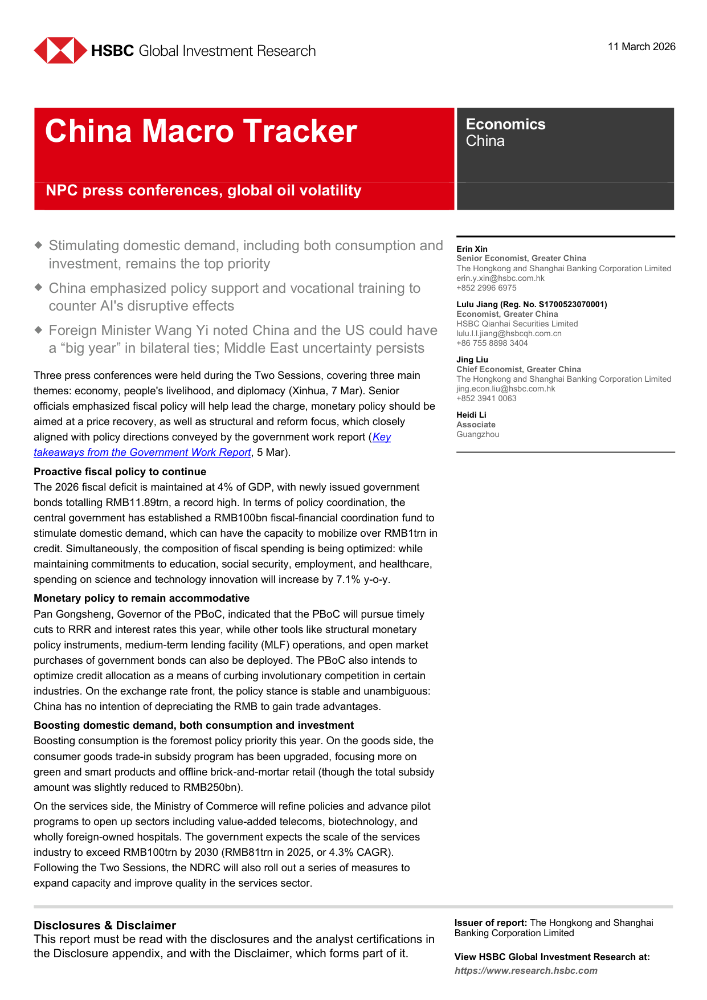

*第 1 页图表预览*

## 第 2 页

Economics ● China

经济学●中国

---

11 March 2026

2026年3月11日

---

Minister of Commerce Wang Wentao also highlighted the need to unlock consumption potential
in lower-tier markets with targeted and differentiated policies: county-level areas and tier-3/4
cities account for 70% of the national population and 60% of GDP, yet their consumption
potential remains largely untapped.

商务部部长王文涛也强调需要释放消费潜力
在有针对性和差异化政策的低层市场：县级地区和-3/4层
城市占全国人口的70%，国内生产总值的60%，但它们的消费
潜力在很大程度上仍未开发。

---

Major projects will drive infrastructure investment. The 15th FYP incorporates 109 major projects
spanning “Six Networks” (water, power grid, computing power, communications, pipeline, and
logistics networks) as well as transportation, education, and healthcare infrastructure. Related
investment in these projects is preliminarily estimated to exceed RMB7trn this year.

重大项目将带动基础设施投资。十五年规划纳入109个重大项目
跨越“六网”（水、电网、算力、通信、管道和
物流网络）以及交通、教育和医疗基础设施。相关的
初步估计，今年这些项目的投资将超过7万亿元人民币。

---

Technology innovation and the development of new productive forces
China's transition from old to new growth drivers will be further accelerated. The NDRC noted
that the six emerging pillar industries (integrated circuits, aerospace, biopharmaceuticals, low-
altitude economy, new energy storage, and intelligent robotics) generated nearly RMB6trn in
output in 2025, with a target to over RMB10trn by 2030. Six future industries (quantum
technology, biomanufacturing, green hydrogen and nuclear fusion, brain-computer interfaces,
embodied intelligence, and 6G) have been identified as the next generation of strategic pillars.

技术创新与新生产力的发展
中国从旧的增长动力向新的增长动力的转变将进一步加快。发改委指出
六大新兴支柱产业（集成电路、航空航天、生物制药、低-
高原经济、新能源储能、智能机器人）产生近6万亿元
2025年产量，目标到2030年超过10万亿元人民币。未来六大产业（量子
技术、生物制造、绿色氢和核聚变、脑机接口、
具身智能和6G）已被确定为下一代战略支柱。

---

Meanwhile, to intensify support for innovation, a national-level M&A fund will be established this
year to drive over RMB1trn in social capital, enhancing the capital velocity of venture and
growth investments. The NDRC will also champion flagship investment programs in RMB100bn
to RMB1trn range in areas including integrated circuits, satellite internet, domestically
developed large commercial aircraft, and computing infrastructure.

同时，为加大对创新的支持力度，将设立国家级并购基金
年带动社会资本超过1万亿元，提高创业资本流动速度
增长投资。国家发改委还将支持1000亿元人民币的旗舰投资项目
集成电路、卫星互联网、国内
开发大型商用飞机和计算基础设施。

---

Capital market reforms can also serve the development of new productive forces. CSRC
Chairman Wu Qing highlighted ChiNext board reform as a key priority, centring on three
elements: 1) more precisely calibrated and inclusive listing standards; 2) replicating the STAR
Market's reform experience by implementing pre-review IPO processes for eligible high-quality
innovative companies; and 3) enhancing the overall quality of ChiNext-listed companies.

资本市场改革也可以服务于新生产力的发展。证监会
吴庆董事长强调创业板改革是重中之重，围绕三个方面
要素：1）更精确地校准和包容性的上市标准；2）复制STAR
通过对符合条件的高质量IPO实施预审查流程的市场改革经验
创新型企业；（三）提升创业板上市公司整体素质。

---

More employment support policies to boost confidence
The Ministry of Human Resources and Social Security is working with relevant departments to
formulate the 15th FYP for Employment, which includes major employment policies and action
plans. Meanwhile, it is studying relevant policies to actively leverage the role of AI in creating
new jobs and empowering traditional jobs, which may include large-scale vocational skills
training and increased support for key groups such as graduates.

出台更多就业支持政策提振信心
人社部正会同有关部门
制定十五年就业规划，包括主要的就业政策和行动
计划。同时，正在研究相关政策，积极发挥人工智能在创造中的作用
新工作和赋予传统工作权力，其中可能包括大规模职业技能
培训和增加对毕业生等关键群体的支持。

---

A “big year” for China-US relations
On 8 March, China’s Foreign Minister Wang Yi held a press conference covering key issues
regarding China-US relations, the Middle East, Japan, and so on. Wang characterized 2026 as
a “landmark” or “big year” for China-US ties, citing ongoing high-level exchanges and expected
a productive visit by US President Trump to China in late March. On the Middle East, Wang
reiterated China’s preference for multilateralism and “open, exclusive” global governance.

中美关系的“大年”
3月8日，中国外交部长王毅就关键问题举行记者招待会
关于中美关系、中东、日本等。王将2026年描述为
中美关系的“里程碑式”或“大年”，引用正在进行的高层交流和预期
美国总统特朗普3月下旬对中国进行了富有成效的访问。关于中东，王
重申了中国对多边主义和“开放、排他性”全球治理的偏好。

---

Middle East conflict continues to pose uncertainties
To counter the risks arising from current Iran situation and surging energy prices, China’s policy
mix so far is pragmatic and defensive: using existing buffers (reserves, trade surplus, domestic-
oriented sectors) while gradually shifting more resources toward energy-independent and
geopolitically diversified growth drivers.

中东冲突继续带来不确定性
为应对当前伊朗局势和能源价格飙升带来的风险，中国的政策
到目前为止，混合是务实和防御性的：利用现有的缓冲（储备、贸易顺差、国内-
同时逐步将更多资源转向能源独立和
地缘政治多元化的增长驱动因素。

---

On the monetary policy front, if elevated global energy prices are prolonged, there is a risk of
reduced urgency by PBOC to pass on policy rate cuts, and instead it may prefer to provide
support through the liquidity channel via RRR cuts and structural monetary tools to targeted
sectors. This will largely depend on the passthrough of energy costs to the broader economy,
though we expect the easing bias will likely remain considering pressures on domestic growth.

在货币政策方面，如果全球能源价格持续上涨，就有可能出现
中国人民银行降低了传递政策降息的紧迫性，相反，它可能更愿意提供
通过降准和结构性货币工具通过流动性渠道支持目标
部门。这将在很大程度上取决于能源成本对更广泛经济的传递，
尽管我们预计，考虑到国内增长面临的压力，宽松倾向可能会继续存在。

---

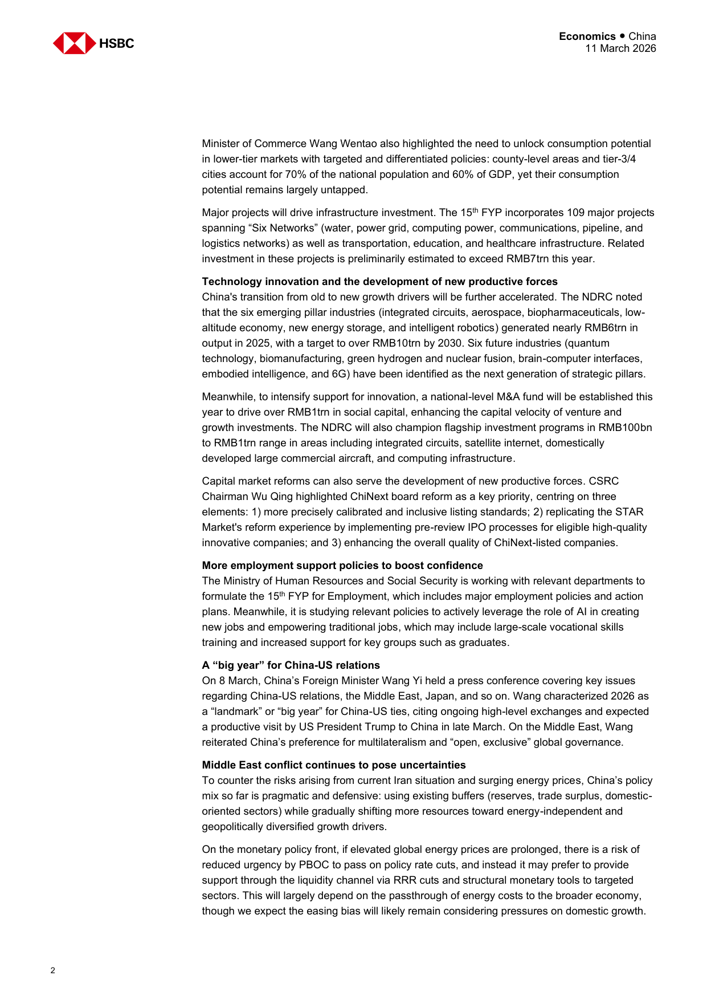

*第 2 页图表预览*

## 第 3 页

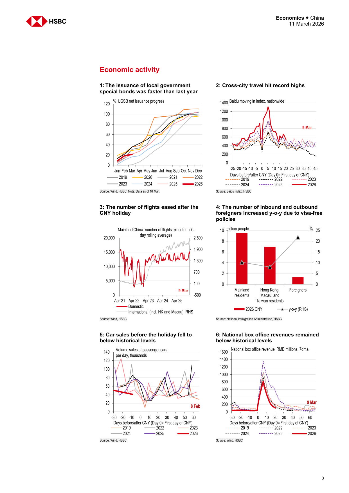

*第 3 页图表预览*

## 第 4 页

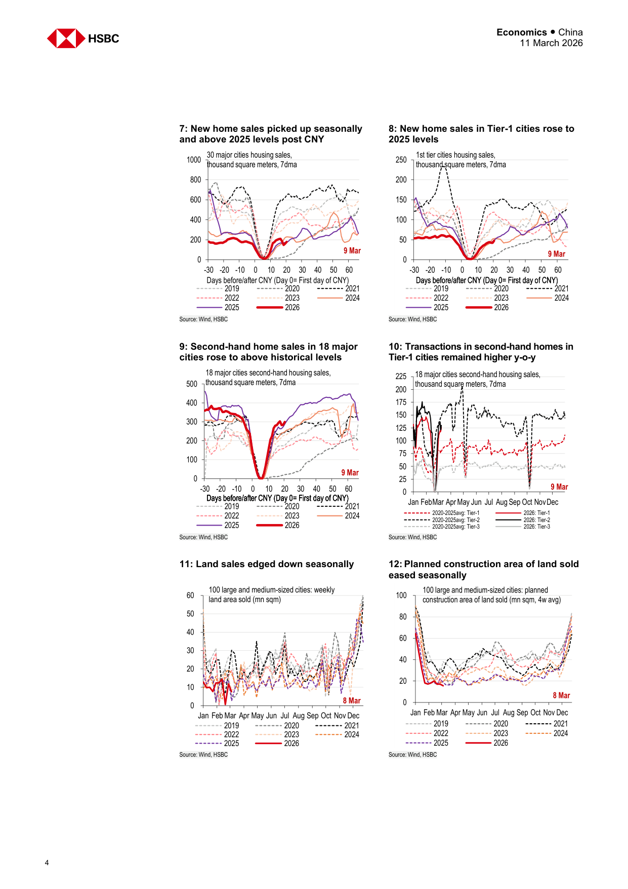

*第 4 页图表预览*

## 第 5 页

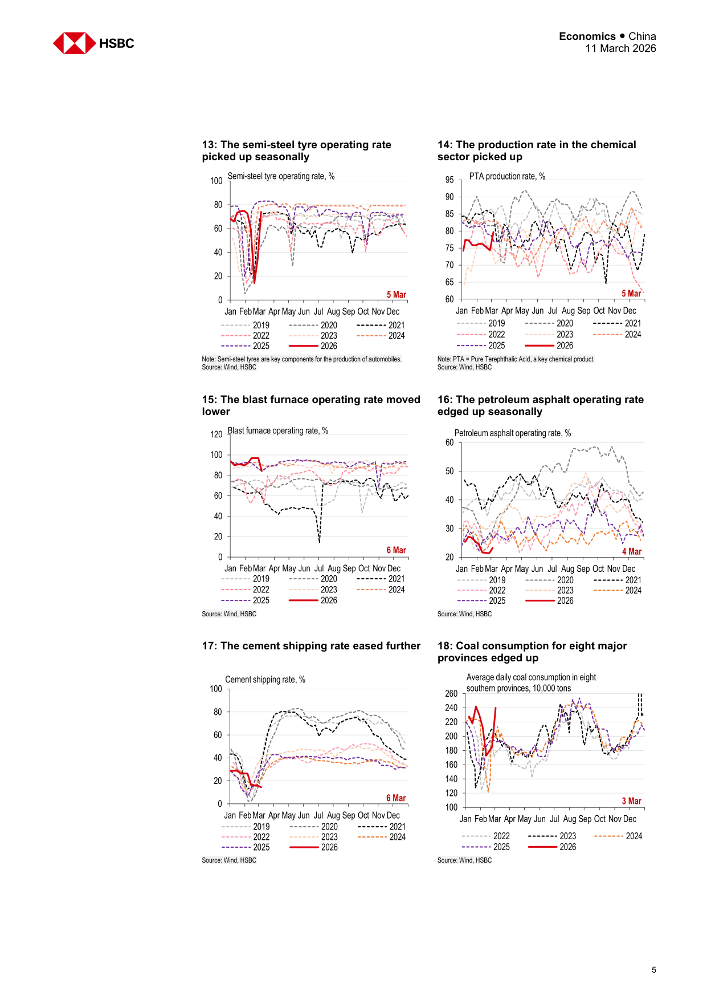

*第 5 页图表预览*

## 第 6 页

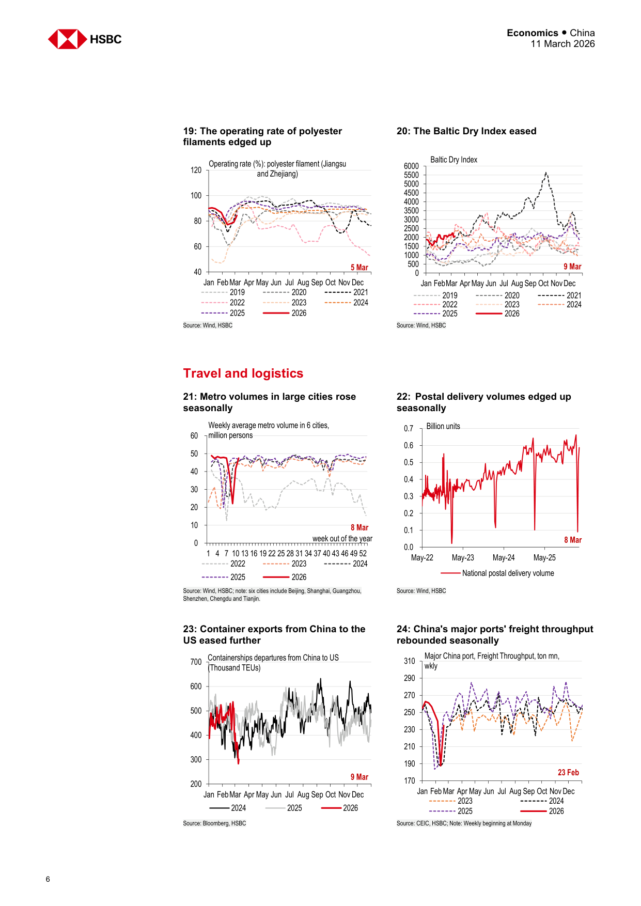

*第 6 页图表预览*

## 第 7 页

R007 (7-day weighted-averaged interbank bond
collateral repo rate )
DR007 (7-day weighted-averaged interbank bond
collateral repo rate: depository institutions)

R007（7天加权平均银行间债券
抵押回购利率）
DR007（7天加权平均银行间债券
抵押回购利率：存款机构）

---

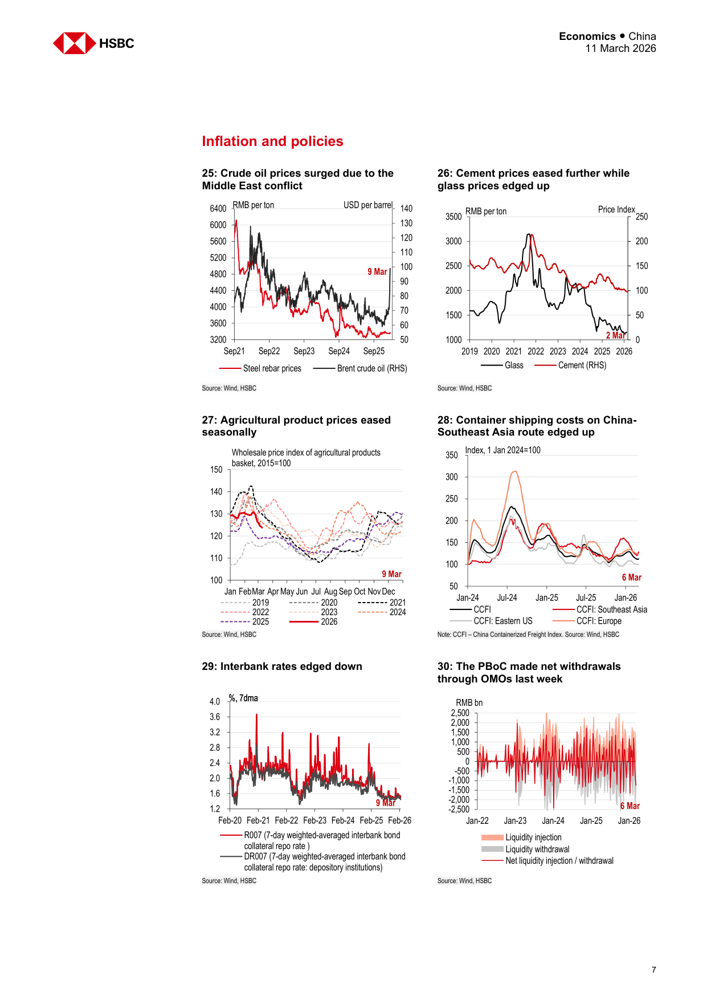

*第 7 页图表预览*

## 第 8 页

Economics ● China

经济学●中国

---

11 March 2026

2026年3月11日

---

Links to recent reports in the China Macro Tracker series

中国宏观跟踪系列近期报告链接

---

China’s Two Sessions in a volatile world, 4 March 2026

动荡世界中的中国两会，2026年3月4日

---

US tariff changes, record breaking CNY holiday, 25 February 2026

美国关税变化，创纪录的春节假期，2026年2月25日

---

Boosting investment and innovation, 11 February 2026

促进投资和创新，2026年2月11日

---

Chinese New Year migration begins, China-UK reset, 4 February 2026

中国新年移民开始，中英重置，2026年2月4日

---

A more conservative approach to the GDP target, 28 January 2026

更保守的GDP目标方法，2026年1月28日

---

Domestic pressures may prompt more urgency, 21 January 2026

2026年1月21日，国内压力可能会引发更多紧迫性

---

Domestic demand needs an investment lift, 14 January 2026

国内需求需要投资提振，2026年1月14日

---

Starting the new year with policy support, 7 January 2026

以政策支持开始新的一年，2026年1月7日

---

Demand-led rebalancing, 17 December 2025

需求导向的再平衡，2025年12月17日

---

Politburo, Pandas and Provincial Five-Year Plans, 10 December 2025

政治局、熊猫和省级五年计划，2025年12月10日

---

Last policy meetings for the year approaching, 3 December 2025

即将到来的一年的最后一次政策会议，2025年12月3日

---

Phone a friend, 26 November 2025

给朋友打电话，2025年11月26日

---

Not yet at the finishing line, 19 November 2025

还没有到达终点线，2025年11月19日

---

A balanced approach, 12 November 2025

平衡的方法，2025年11月12日

---

A new tenuous equilibrium, 5 November 2025

一个新的脆弱平衡，2025年11月5日

---

Potential trade breakthroughs, 29 October 2025

潜在的贸易突破，2025年10月29日

---

Deal or no deal, 22 October 2025

成交与否，2025年10月22日

---

On pins and needles, 15 October 2025

如坐针毡，2025年10月15日

---

New measures before the Golden Week, 1 October 2025

2025年10月1日黄金周前的新措施

---

Talking points, 24 September 2025

谈话要点，2025年9月24日

---

US-China talks see progress in Madrid, 17 September 2025

2025年9月17日，马德里，美中会谈取得进展

---

Anti-involution to help longer-term development, 10 September 2025

帮助长期发展的反内卷化，2025年9月10日

---

Domestic reforms accelerating, 3 September 2025

国内改革加速，2025年9月3日

---

Green transition to help the anti-involution campaign, 27 August 2025

帮助反内卷运动的绿色过渡，2025年8月27日

---

More measures to support growth, 20 August 2025

支持增长的更多措施，2025年8月20日

---

Another 90-day tariff truce, 13 August 2025

另一个90天关税休战，2025年8月13日

---

A clear pro-growth tone, 6 August 2025

明确的促增长基调，2025年8月6日

---

Tailwinds from services subsidies, 29 July 2025

服务补贴的顺风，2025年7月29日

---

July Politburo may mean structural moves, 23 July 2025

7月政治局可能意味着结构性举措，2025年7月23日

---

China’s new urbanisation plan, 16 July 2025

中国的新城镇化计划，2025年7月16日

---

Supply-side reform 2.0? 9 July 2025

供给侧改革2.0？2025年7月9日

---

Signed and sealed, 2 July 2025

签署并盖章，2025年7月2日

---

Domestic consumption becoming brighter, 25 June 2025

国内消费变得更加光明，2025年6月25日

---

Working on domestic matters, 18 June

处理国内事务，6月18日

---

Increased support for people's livelihood, 11 June 2025

增加对民生的支持，2025年6月11日

---

Anyone’s call, 4 June 2025

任何人的电话，2025年6月4日

---

Broadening cooperation and boosting consumption, 28 May 2025

扩大合作和促进消费，2025年5月28日

---

Mixed signals during the tariff pause, 21 May 2025

关税暂停期间的混合信号，2025年5月21日

---

More than just reciprocal tariffs paused, 14 May 2025

不仅仅是暂停互惠关税，2025年5月14日

---

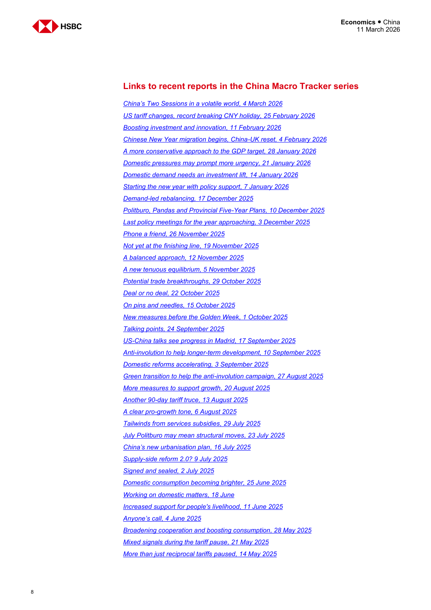

*第 8 页图表预览*

## 第 9 页

Economics ● China

经济学●中国

---

11 March 2026

2026年3月11日

---

Disclosure appendix

披露附录

---

Analyst Certification
The following analyst(s), economist(s), or strategist(s) who is(are) primarily responsible for this report, including any analyst(s)
whose name(s) appear(s) as author of an individual section or sections of the report and any analyst(s) named as the covering
analyst(s) of a subsidiary company in a sum-of-the-parts valuation certifies(y) that the opinion(s) on the subject security(ies) or
issuer(s), any views or forecasts expressed in the section(s) of which such individual(s) is(are) named as author(s), and any other
views or forecasts expressed herein, including any views expressed on the back page of the research report, accurately reflect
their personal view(s) and that no part of their compensation was, is or will be directly or indirectly related to the specific
recommendation(s) or views contained in this research report: Erin Xin, Lulu Jiang and Jing Liu

分析师认证
主要负责本报告的以下分析师、经济学家或战略家，包括任何分析师
其姓名出现在报告的一个或多个章节的作者和任何被命名为封面的分析师
附属公司的分析师在部分总和估值中证明（y）关于标的证券的意见或
发行人、在该等个人被指称为作者的章节中表达的任何观点或预测，以及任何其他
本文表达的观点或预测，包括研究报告背面表达的任何观点，准确反映
他们的个人观点，以及他们的补偿没有任何部分过去、现在或将来与特定的
本研究报告中包含的推荐或观点：辛艾琳、蒋露露和刘静

---

Important disclosures
This document has been prepared and is being distributed by the Research Department of HSBC and is intended solely for the
clients of HSBC and is not for publication to other persons, whether through the press or by other means.

重要披露
本文件由汇丰研究部准备并分发，仅供
汇丰银行的客户，不得通过新闻界或其他方式向其他人发布。

---

This document is for information purposes only and it should not be regarded as an offer to sell or as a solicitation of an offer to
buy the securities or other investment products mentioned in it and/or to participate in any trading strategy.  Advice in this document
is general and should not be construed as personal advice, given it has been prepared without taking account of the objectives,
financial situation or needs of any particular investor.  Accordingly, investors should, before acting on the advice, consider the
appropriateness of the advice, having regard to their objectives, financial situation and needs. If necessary, seek professional
investment and tax advice.

本文件仅供参考，不应被视为出售要约或要约邀请
购买其中提到的证券或其他投资产品和/或参与任何交易策略。本文档中的建议
是笼统的，不应被解释为个人建议，因为它是在没有考虑目标的情况下准备的，
任何特定投资者的财务状况或需求。因此，投资者在根据建议采取行动之前，应考虑
考虑到他们的目标、财务状况和需求，建议的适当性。如有必要，寻求专业人士
投资和税务建议。

---

Certain investment products mentioned in this document may not be eligible for sale in some states or countries, and they may
not be suitable for all types of investors. Investors should consult with their HSBC representative regarding the suitability of the
investment products mentioned in this document and take into account their specific investment objectives, financial situation or
particular needs before making a commitment to purchase investment products.

本文件中提到的某些投资产品可能不符合某些州或国家的销售条件，它们可能
并不适合所有类型的投资者。投资者应咨询其汇丰代表
本文件中提到的投资产品，并考虑其特定的投资目标、财务状况或
在承诺购买投资产品之前的特殊需求。

---

The value of and the income produced by the investment products mentioned in this document may fluctuate, so that an investor
may get back less than originally invested.  Certain high-volatility investments can be subject to sudden and large falls in value
that could equal or exceed the amount invested.  Value and income from investment products may be adversely affected by
exchange rates, interest rates, or other factors.  Past performance of a particular investment product is not indicative of future
results.

本文件中提及的投资产品的价值和产生的收入可能会波动，因此投资者
回报可能低于最初投资的回报。某些高波动性投资可能会突然大幅贬值
可能等于或超过投资金额。投资产品的价值和收入可能受到以下因素的不利影响
汇率、利率或其他因素。特定投资产品的过去表现并不代表未来
结果。

---

HSBC and its affiliates will from time to time sell to and buy from customers the securities/instruments, both equity and debt
(including derivatives) of companies covered in HSBC Research on a principal or agency basis or act as a market maker or
liquidity provider in the securities/instruments mentioned in this report.

汇丰银行及其附属公司将不时向客户出售和购买证券/工具，包括股票和债务
（包括衍生工具）汇丰研究以委托人或代理为基础或作为做市商或
本报告提及的证券/工具的流动性提供者。

---

Analysts, economists, and strategists are paid in part by reference to the profitability of HSBC which includes investment banking,
sales & trading, and principal trading revenues.

分析师、经济学家和策略师的薪酬部分取决于汇丰银行的盈利能力，包括投资银行业务，
销售和交易，以及主要交易收入。

---

Whether, or in what time frame, an update of this analysis will be published is not determined in advance.

该分析的更新是否或在什么时间框架内发布并未提前确定。

---

For disclosures in respect of any company mentioned in this report, please see the most recently published report on that company
available at www.hsbcnet.com/research. HSBC Private Bank clients should contact their Relationship Manager for queries
regarding other research reports. In order to find out more about the proprietary models used to produce this report, please contact
the authoring analyst.

有关本报告中提及的任何公司的披露，请参阅该公司最近发布的报告
www.hsbcnet.com/research。汇丰私人银行客户如有查询，请联络其客户关系经理
关于其他研究报告。为了了解更多关于用于制作本报告的专有模型的信息，请联系
创作分析师。

---

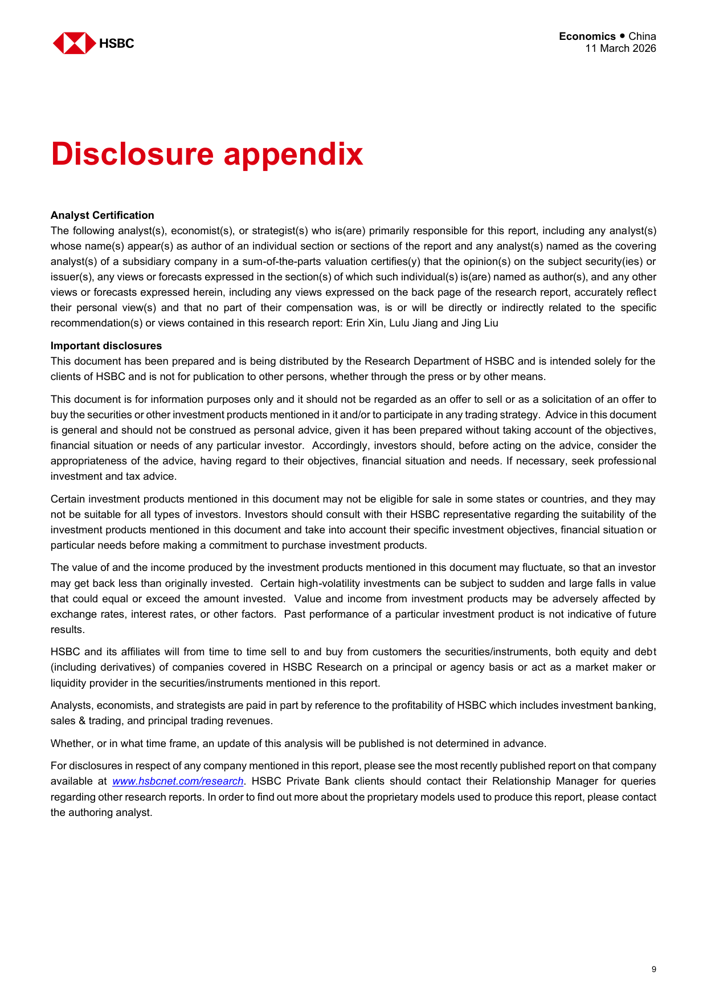

*第 9 页图表预览*

## 第 10 页

Economics ● China

经济学●中国

---

11 March 2026

2026年3月11日

---

Additional disclosures

额外披露

---

1
This report is dated as at 11 March 2026.

1
本报告的日期为2026年3月11日。

---

2
All market data included in this report are dated as at close 10 March 2026, unless a different date and/or a specific time of
day is indicated in the report.

2
本报告中包含的所有市场数据的日期均为2026年3月10日，除非日期和/或具体时间不同
报告中指出了日期。

---

3
HSBC has procedures in place to identify and manage any potential conflicts of interest that arise in connection with its
Research business. HSBC's analysts and its other staff who are involved in the preparation and dissemination of
Research operate and have a management reporting line independent of HSBC's Investment Banking business.
Information Barrier procedures are in place between the Investment Banking, Principal Trading, and Research businesses
to ensure that any confidential and/or price sensitive information is handled in an appropriate manner.

3
汇丰银行有适当的程序来识别和管理与其相关的任何潜在利益冲突
研究业务。汇丰银行的分析师和其他参与编制和传播
研究运作并拥有独立于汇丰投资银行业务的管理报告线。
信息壁垒程序在投资银行、主要交易和研究业务之间到位
确保以适当的方式处理任何机密和/或价格敏感信息。

---

4
You are not permitted to use, for reference, any data in this document for the purpose of (i) determining the interest
payable, or other sums due, under loan agreements or under other financial contracts or instruments, (ii) determining the
price at which a financial instrument may be bought or sold or traded or redeemed, or the value of a financial instrument,
and/or (iii) measuring the performance of a financial instrument or of an investment fund.

4
您不得使用本文档中的任何数据作为参考，以（i）确定利益
根据贷款协议或其他金融合同或工具应付或其他应付款项，（ii）确定
金融工具可买卖、交易或赎回的价格，或金融工具的价值，
和/或（iii）衡量金融工具或投资基金的表现。

---

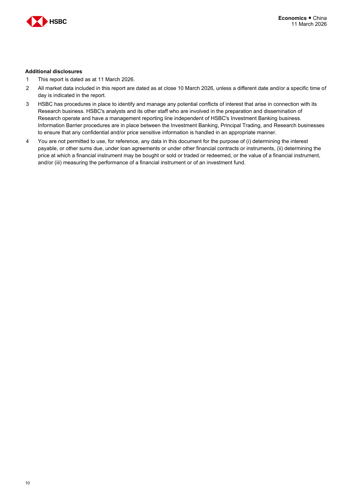

*第 10 页图表预览*

## 第 11 页

Economics ● China

经济学●中国

---

11 March 2026

2026年3月11日

---

Disclaimer

免责声明

---

Legal entities as at 7 December 2024:
HSBC Bank plc; HSBC Continental Europe; HSBC Continental Europe SA, Germany; HSBC Bank Middle East Limited, DIFC;
HSBC Bank Middle East Limited, UAE branch; HSBC Yatirim Menkul Degerler AS, Istanbul; The Hongkong and Shanghai
Banking Corporation Limited, Hong Kong; The Hongkong and Shanghai Banking Corporation Limited, Singapore Branch;
The Hongkong and Shanghai Banking Corporation Limited, Seoul Securities Branch; The Hongkong and Shanghai Banking
Corporation Limited, Seoul Branch; HSBC Qianhai Securities Limited; HSBC Securities (Taiwan) Corporation Limited; HSBC
Securities and Capital Markets (India) Private Limited, Mumbai; HSBC Bank Australia Limited; HSBC Securities (USA) Inc.,
New York; HSBC México, SA, Institución de Banca Múltiple, Grupo Financiero HSBC; Banco HSBC SA

截至2024年12月7日的法人实体：
汇丰银行股份有限公司；汇丰欧洲大陆；汇丰欧洲大陆股份有限公司，德国；汇丰银行中东有限公司，DIFC；
汇丰银行中东有限公司阿联酋分行；汇丰银行Yatirim Menkul Demerler AS伊斯坦布尔分行；香港和上海分行
香港汇丰银行有限公司；香港上海汇丰银行有限公司新加坡分行；
香港上海汇丰银行有限公司首尔证券分行；香港上海汇丰银行
股份有限公司首尔分公司；汇丰前海证券有限公司；汇丰证券（台湾）有限公司；汇丰银行
孟买证券和资本市场（印度）私人有限公司；汇丰银行澳大利亚有限公司；汇丰证券（美国）有限公司，
纽约；汇丰墨西哥银行、SA、Manca Múltiple银行、Grupo金融汇丰银行；汇丰银行SA

---

Issuer of report
The Hongkong and Shanghai Banking Corporation
Limited
Level 16, 1 Queen's Road Central
Hong Kong SAR
Telephone: +852 2843 9111
Fax: +852 2801 4138
Website: www.research.hsbc.com

报告签发人
香港上海汇丰银行
有限
皇后大道中1号16楼
香港特别行政区
电话：+852 2843 9111
传真：+852 2801 4138
网址：www.research.hsbc.com

---

The Hongkong and Shanghai Banking Corporation Limited ("HSBC") has issued this research material. The Hongkong and Shanghai Banking Corporation Limited is regulated by the Hong Kong
Monetary Authority. If it is received by a customer of an affiliate of HSBC, its provision to the recipient is subject to the terms of business in place between the recipient and such affiliate. Any
recommendations contained in it are intended for the professional investors to whom it is distributed. This material is not and should not be construed as an offer to sell or the solicitation of an offer
to purchase or subscribe for any investment. HSBC has based this document on information obtained from sources it believes to be reliable but which it has not independently verified; HSBC

香港上海汇丰银行有限公司（「汇丰」）已发出本研究资料。香港上海汇丰银行有限公司受香港
金融管理专员。如汇丰附属公司的客户收到该等资料，则向收件人提供该等资料须受收件人与该附属公司之间的业务条款所规限。任何
其中包含的建议旨在向其分发的专业投资者提供。本材料不是也不应被解释为出售要约或要约征集
购买或认购任何投资。汇丰银行本文件基于从其认为可靠但未经独立核实的来源获得的信息；汇丰银行

---

makes no guarantee, representation or warranty and accepts no responsibility or liability as to its accuracy or completeness. Expressions of opinion are those of HSBC only and are subject to
change without notice. From time to time research analysts conduct site visits of covered issuers. HSBC policies prohibit research analysts from accepting payment or reimbursement for travel
expenses from the issuer for such visits. The decision and responsibility on whether or not to invest must be taken by the reader. HSBC and its affiliates and/or their officers, directors and employees
may have positions in any securities mentioned in this document (or in any related investment) and may from time to time add to or dispose of any such securities (or investment). HSBC and its
affiliates may act as market maker or have assumed an underwriting commitment in the securities of any companies discussed in this document (or in related investments), may sell them to or
buy them from customers on a principal basis and may also perform or seek to perform banking or underwriting services for or relating to those companies. This material may not be further
distributed in whole or in part for any purpose. No consideration has been given to the particular investment objectives, financial situation or particular needs of any recipient. The document is
intended to be distributed in its entirety. Unless governing law permits otherwise, you must contact a HSBC Group member in your home jurisdiction if you wish to use HSBC Group services in

不作任何保证、陈述或保证，对其准确性或完整性不承担任何责任或义务。意见表达仅代表汇丰银行，并受制于
更改恕不另行通知。研究分析师不时对承保发行人进行实地考察。汇丰政策禁止研究分析师接受差旅付款或报销
发行人进行此类访问的费用。是否投资的决定和责任必须由读者承担。汇丰银行及其关联公司和/或其高级职员、董事和雇员
可能持有本文件中提及的任何证券（或任何相关投资）的头寸，并且可能不时增加或处置任何此类证券（或投资）。汇丰银行及其
关联公司可以充当做市商或已对本文件中讨论的任何公司的证券（或相关投资）承担承销承诺，可以将其出售给或
以主体为基础从客户那里购买，也可能为这些公司或与这些公司有关的公司提供或寻求提供银行或承销服务。本材料可能不会进一步
为任何目的全部或部分分发。没有考虑任何接受者的特定投资目标、财务状况或特定需求。该文件是
打算全部分发。除非适用法律另有许可，否则如果您希望在以下网站使用汇丰集团服务，您必须联系您所在司法管辖区的汇丰集团成员

---

effecting a transaction in any investment mentioned in this document.
In the UK, this publication is distributed by HSBC Bank plc for the information of its Clients (as defined in the Rules of FCA) and those of its affiliates only. Nothing herein excludes or restricts any
duty or liability to a customer which HSBC Bank plc has under the Financial Services and Markets Act 2000 or under the Rules of FCA and PRA. A recipient who chooses to deal with any person
who is not a representative of HSBC Bank plc in the UK will not enjoy the protections afforded by the UK regulatory regime. HSBC Bank plc is regulated by the Financial Conduct Authority and the
Prudential Regulation Authority.
In the European Economic Area, this publication has been distributed by HSBC Continental Europe or by such other HSBC affiliate from which the recipient receives relevant services.
This material is distributed in Japan by HSBC Securities (Japan) Co., Ltd.. In Korea, this publication is distributed by either The Hongkong and Shanghai Banking Corporation Limited, Seoul
Securities Branch ("HBAP SLS") or The Hongkong and Shanghai Banking Corporation Limited, Seoul Branch ("HBAP SEL") for the general information of professional investors specified in Article
9 of the Financial Investment Services and Capital Markets Act ("FSCMA"). This publication is not a prospectus as defined in the FSCMA. It may not be further distributed in whole or in part for
any purpose. Both HBAP SLS and HBAP SEL are regulated by the Financial Services Commission and the Financial Supervisory Service of Korea. In Singapore, this publication is distributed by
The Hongkong and Shanghai Banking Corporation Limited, Singapore Branch for the general information of institutional investors or other persons specified in Sections 274 and 304 of the
Securities and Futures Act (Chapter 289) ("SFA") and accredited investors and other persons in accordance with the conditions specified in Sections 275 and 305 of the SFA. Only Economics or

对本文件中提到的任何投资进行交易。
在英国，本出版物由HSBC Bank plc分发，仅供其客户（定义见FCA规则）及其关联公司参考。此处不排除或限制任何
HSBC Bank plc根据2000年金融服务和市场法或FCA和PRA规则对客户承担的义务或责任。选择与任何人打交道的收件人
不是汇丰银行在英国的代表的人将不享受英国监管制度提供的保护。汇丰银行受金融行为监管局和
审慎监管局。
在欧洲经济区，本出版物由汇丰欧洲大陆或收件人获得相关服务的其他汇丰附属机构发行。
本资料由汇丰证券（日本）有限公司在日本发行。在韩国，本出版物由首尔香港上海汇丰银行有限公司发行
证券分行（「HBAP SLS」）或香港上海汇丰银行有限公司首尔分行（「HBAP SEL」），供专业投资者参考
《金融投资服务和资本市场法》（“FSCMA”）第9条。本出版物不是FSCMA定义的招股说明书。它不得全部或部分进一步分发
任何目的。HBAP SLS和HBAP SEL均受韩国金融服务委员会和金融监管局监管。在新加坡，本出版物由
香港上海汇丰银行有限公司新加坡分行，供机构投资者或《
证券和期货法（第289章）（“SFA”）以及符合SFA第275条和第305条规定条件的合格投资者和其他人。只有经济或

---

Currencies reports are intended for distribution to a person who is not an Accredited Investor, Expert Investor or Institutional Investor as defined in SFA. The Hongkong and Shanghai Banking
Corporation Limited, Singapore Branch accepts legal responsibility for the contents of reports. This publication is not a prospectus as defined in the SFA. It may not be further distributed in whole
or in part for any purpose. The Hongkong and Shanghai Banking Corporation Limited Singapore Branch is regulated by the Monetary Authority of Singapore. Recipients in Singapore should
contact a "Hongkong and Shanghai Banking Corporation Limited, Singapore Branch" representative in respect of any matters arising from, or in connection with this report. Please refer to The
Hongkong and Shanghai Banking Corporation Limited Singapore Branch's website at www.business.hsbc.com.sg for contact details. In Australia, this publication has been distributed by The
Hongkong and Shanghai Banking Corporation Limited (ABN 65 117 925 970, AFSL 301737) for the general information of its "wholesale" customers (as defined in the Corporations Act 2001).
Where distributed to retail customers, this research is distributed by HSBC Bank Australia Limited (ABN 48 006 434 162, AFSL No. 232595). These respective entities make no representations
that the products or services mentioned in this document are available to persons in Australia or are necessarily suitable for any particular person or appropriate in accordance with local law. No
consideration has been given to the particular investment objectives, financial situation or particular needs of any recipient.
HSBC Securities (USA) Inc. accepts responsibility for the content of this research report prepared by its non-US foreign affiliate. The information contained herein is under no circumstances to be
construed as investment advice and is not tailored to the needs of the recipient. All US persons receiving and/or accessing this report and intending to effect transactions in any security discussed
herein should do so with HSBC Securities (USA) Inc. in the United States and not with its non-US foreign affiliate, the issuer of this report. HSBC México, SA, Institución de Banca Múltiple, Grupo
Financiero HSBC is authorized and regulated by Secretaría de Hacienda y Crédito Público and Comisión Nacional Bancaria y de Valores (CNBV).In Brazil, this document has been distributed by
Banco HSBC SA ("HSBC Brazil"), and/or its affiliates. As required by Resolution No. 20/2021 of the Securities and Exchange Commission of Brazil (Comissão de Valores Mobiliários), potential
conflicts of interest concerning (i) HSBC Brazil and/or its affiliates; and (ii) the analyst(s) responsible for authoring this report are stated on the chart above labelled "HSBC & Analyst Disclosures".
If you are a customer of HSBC International Wealth & Premier Banking ("IWPB"), including HSBC Private Bank, you are eligible to receive this publication only if: (i) you have been approved to
receive relevant research publications by an applicable HSBC legal entity; (ii) you have agreed to the applicable HSBC entity's terms and conditions and/or customer declaration for accessing
research; and (iii) you have agreed to the terms and conditions of any other internet banking, online banking, mobile banking and/or investment services offered by that HSBC entity, through which
you will access research publications (collectively with (ii), the "Terms"). If you do not meet the above eligibility requirements, please disregard this publication and, if you are a IWPB customer,

货币报告旨在分发给SFA定义的认可投资者、专家投资者或机构投资者以外的人。香港上海汇丰银行
有限公司新加坡分公司对报告内容承担法律责任。本出版物不是SFA定义的招股说明书。它可能不会全部进一步分发
或部分用于任何目的。香港上海汇丰银行有限公司新加坡分行受新加坡金融管理局监管。在新加坡的收款人应
就本报告引起或与本报告有关的任何事宜，请联络“香港上海汇丰银行有限公司新加坡分行”代表。请参阅
香港上海汇丰银行有限公司新加坡分行的网页www.business.hsbc.com.sg，以获取联络详情。在澳大利亚，本刊物由
香港上海汇丰银行有限公司（ABN 65 117 925 970， AFSL 301737）提供其“批发”客户（定义见2001年公司法）的一般信息。
本研究由汇丰银行澳大利亚有限公司（ABN 48 006 434 162，AFSL编号232595）分发给零售客户。这些实体不做任何陈述
本文件中提到的产品或服务可供澳大利亚境内的人使用，或者必然适合任何特定的人或根据当地法律是适当的。没有
已考虑到任何接受者的特定投资目标、财务状况或特殊需求。
汇丰证券（美国）有限公司对其非美国外国附属公司编制的本研究报告的内容承担责任。此处包含的信息在任何情况下都不会
解释为投资建议，并非针对接收者的需求量身定制。所有收到和/或访问本报告并打算在所讨论的任何证券中进行交易的美国人
此处应与美国的汇丰证券（美国）有限公司（HSBC Securities（USA）Inc.）联系，而不是与其非美国外国附属公司（本报告的发行人）联系。汇丰墨西哥，SA，银行研究所，Grupo
金融汇丰银行由庄园和信贷秘书和国家银行委员会（CNBV）授权和监管。在巴西，本文件由
汇丰银行股份有限公司（“汇丰巴西”）和/或其关联公司。根据巴西证券交易委员会（Comissão de Valores Mobiliaários）第20/2021号决议的要求，潜在的
利益冲突涉及（i）汇丰巴西和/或其关联公司；（ii）负责撰写本报告的分析师在上面标有“汇丰和分析师披露”的图表中说明。
如果您是汇丰国际财富卓越理财（“IWPB”）的客户，包括汇丰私人银行，您只有在以下情况下才有资格收到本出版物：（i）您已获得批准
接收适用的汇丰法务主体的相关研究出版物；（ii）您已同意适用的汇丰实体的条款和条件及/或客户声明
研究；（iii）您已同意该汇丰实体提供的任何其他网上银行、网上银行、手机银行和/或投资服务的条款和条件，通过这些条款和条件
您将访问研究出版物（与（ii）统称为“条款”）。如果您不符合上述资格要求，请忽略本出版物，如果您是IWPB客户，

---

please notify your Relationship Manager or call the relevant customer hotline. Distribution of this publication is the sole responsibility of the HSBC entity with whom you have agreed the Terms.
Receipt of research publications is strictly subject to the Terms and any other conditions or disclaimers applicable to the provision of the publications that may be advised by IWPB.
© Copyright 2026, The Hongkong and Shanghai Banking Corporation Limited, ALL RIGHTS RESERVED. No part of this publication may be reproduced, stored in a retrieval system, or transmitted,
on any form or by any means, electronic, mechanical, photocopying, recording, or otherwise, without the prior written permission of The Hongkong and Shanghai Banking Corporation Limited.

请通知您的客户经理或致电相关客户热线。本出版物的分发由与您同意条款的汇丰实体全权负责。
研究出版物的接收严格遵守本条款以及IWPB可能告知的适用于提供出版物的任何其他条件或免责声明。
©版权所有2026，香港上海汇丰银行有限公司，保留所有权利。本出版物的任何部分不得复制、存储在检索系统中或传输，
未经香港上海汇丰银行有限公司事先书面许可，以任何形式或以任何方式，电子、机械、影印、录音或其他方式。

---

[1275012]

[1275012]

---

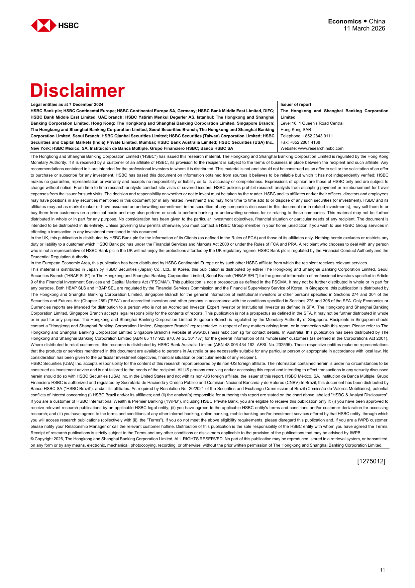

*第 11 页图表预览*
